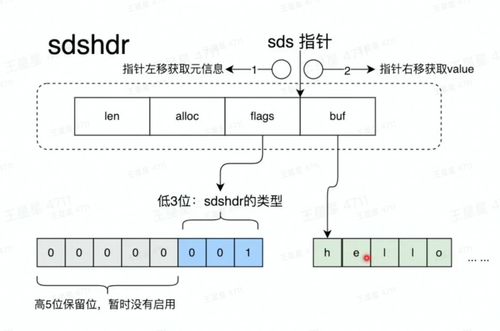
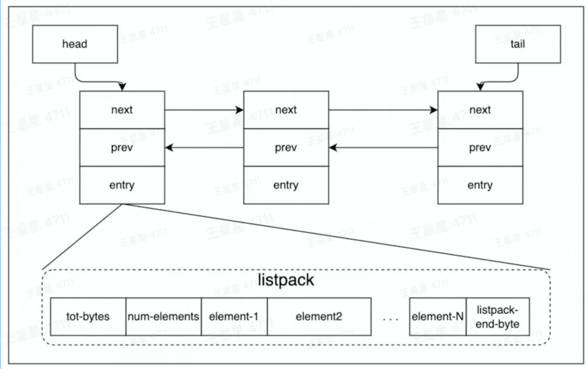
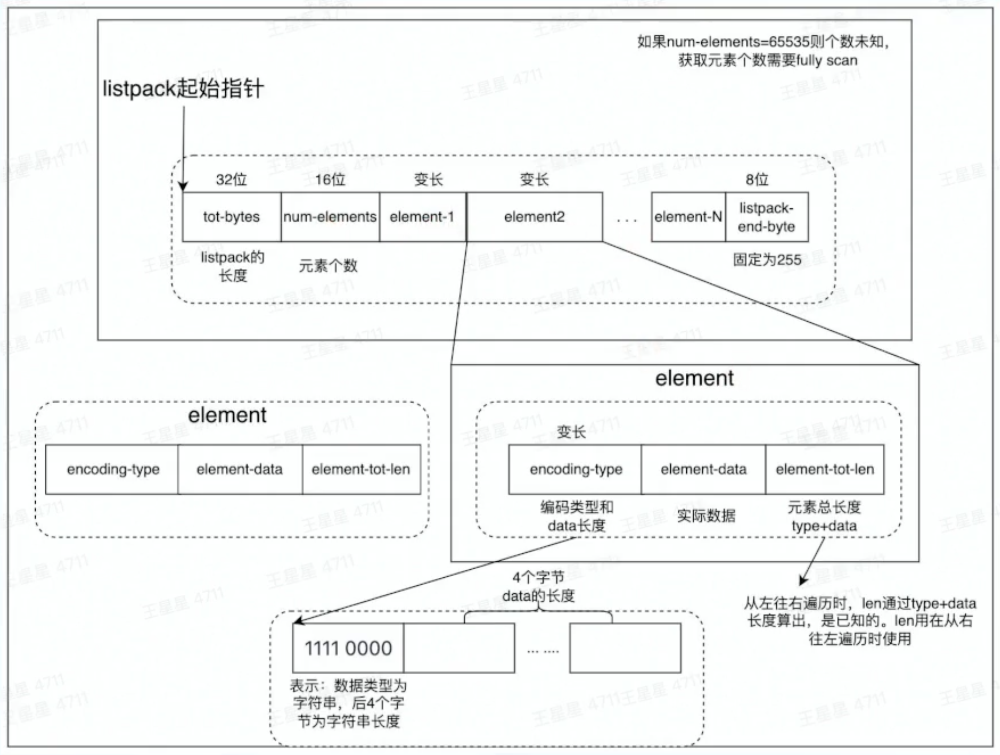
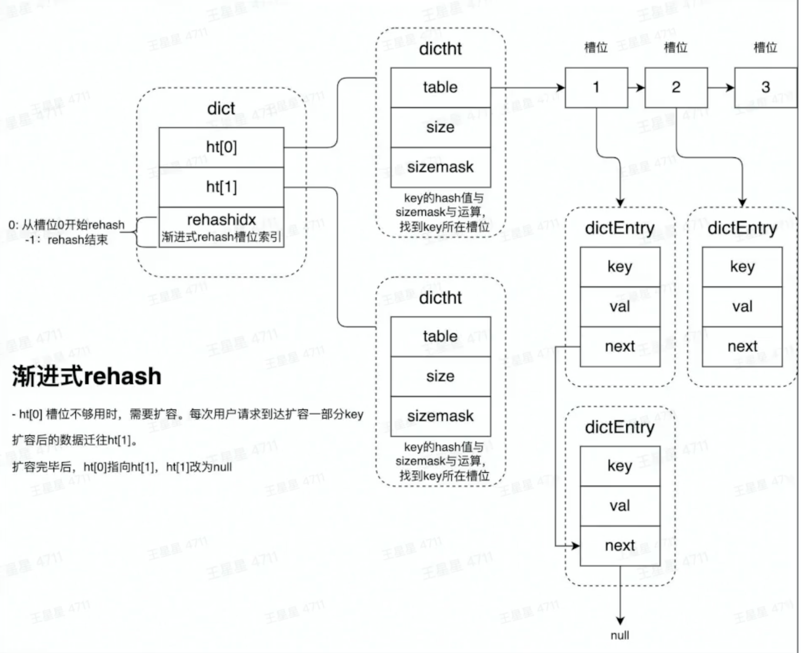
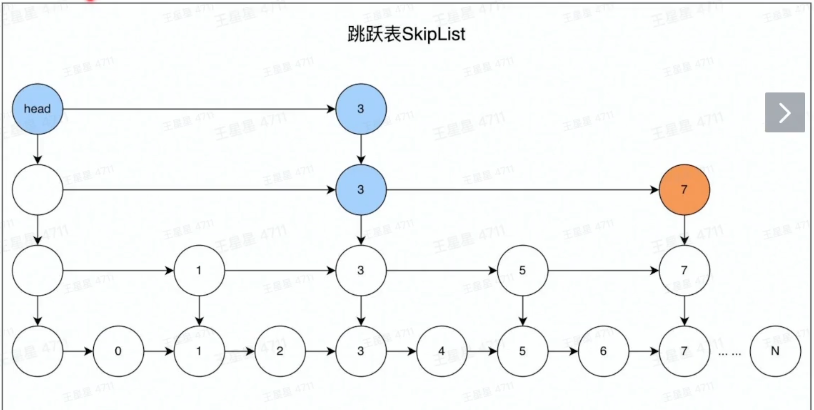
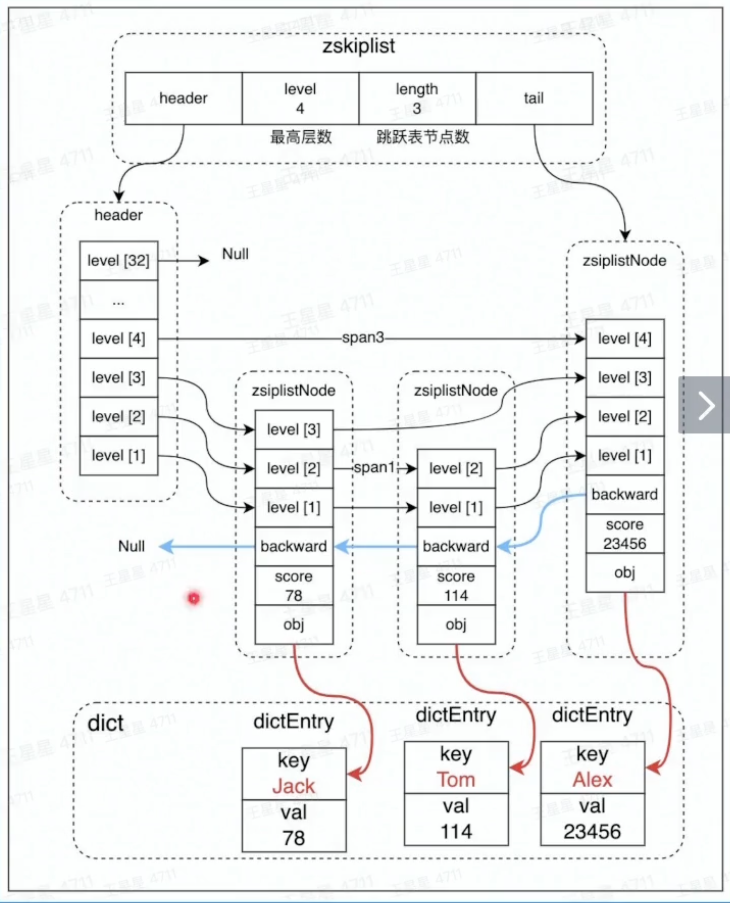

# Redis的数据结构

## String

**String** ： sds （二进制安全）

+ 可以存储字符串、数字、二进制数据
+ 通常和expire搭配使用
+ 场景：存储计数、Session

图中就是一个string结构

+ len 存的是string中所存储数据的实际长度
+ alloc 存储的是这个string存储单元实际申请的存储空间大小
+ flags 表示的是当前存储单元的类型
+ buf里面是申请的内存，然后前len位是存储的具体的数据

## List

List数据结构 Quicklist

QuickList由一个双向链表和listpack实现

一个链表的节点由next、prev和entry组成。

redis为了节约内存，因此会在listpack中存储很多数据，比如在listpack里面存多条数据，

在listpack中：

+ num-elements： 存储的是在这个listpack中存储了几个元素，（每个element所占的大小是一样的）
+ tot-bytes：记录的是整个内存空间有多大

## Hash

Hash数据结构dict

+ rehash：rehash操作是将ht[0]中的数据，全部迁移到ht[1]中。数据量小的场景下，直接将ht[0]拷贝到ht[1]速度是比较快的。数据量大的场景，例如存有上百万的KV时，迁移过程将会明显阻塞用户请求。

+ 渐进式hash：为避免出现rehash中阻塞用户请求的情况，使用了rehash方案，基本原理就是，每次用户访问时都会迁移少量数据。将这个迁移过程，平摊到所有的访问用户请求过程中

	

	

## zset

zset数据结构，zskiplist （有序集合）

+ 查找数字7的路径 head ，3，3，7
+ 结合dict以后，可通过key操作跳表的功能

