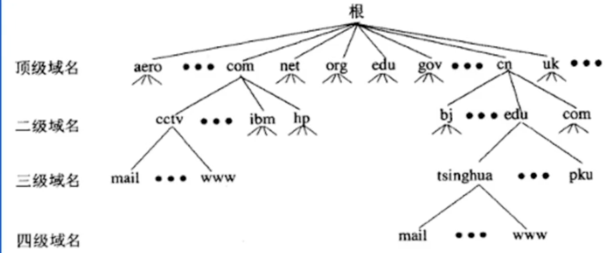

# 企业级接入

Host的管理：

​	使用域名系统来替换Host文件；

关于域名空间：

+ 域名空间被组织成树形结构
+ 域名空间通过划分zone的方式进行分层授权管理
+ 全球公共域名空间进对应一棵树
+ 根域名服务器：查询起点
+ 域名组成格式：[a-zA-Z0-9_-],以点划分label

## 自建DNS服务器

+ 内网域名的解析也得去公网获取，效率低下
+ 外部用户看到内网ip地址，容易被hacker攻击
+ 云厂商DNS如果出现故障，影响用户体验
+ 持续扩大公司品牌技术影响力，使用自己的DNS系统

## DNS记录类型

A/AAAA：IP指向记录，用于指向IP，前者为IPV4后者为IPV6

CNAME：别名记录，配置值为别名或主机名，客户端根据别名继续解析以提取1P地址

TXT：文本记录，购买证书时需要

Mx：邮件交换记录，用于指向邮件交换服务器

NS： 解析服务器记录，用于指定哪台服务器对于该域名解析

SOA 记录：起始投权机构记录，每个zone有且仅有唯一的一条SOA记录，SOA是描述zone属性以及主 要权威服务器的记录

## 对称加密和非对称加密

**对称加密（Symmetric Cryptography）**

对称加密是最快速、最简单的一种加密方式，加密（encryption）与解密（decryption）用的是同样的密钥（secret key）。对称加密有很多种算法，由于它效率很高，所以被广泛使用在很多加密协议的核心当中。对称加密通常使用的是相对较小的密钥，一般小于256 bit。因为密钥越大，加密越强，但加密与解密的过程越慢。如果你只用1 bit来做这个密钥，那黑客们可以先试着用0来解密，不行的话就再用1解；但如果你的密钥有1 MB大，黑客们可能永远也无法破解，但加密和解密的过程要花费很长的时间。密钥的大小既要照顾到安全性，也要照顾到效率，是一个trade-off。

对称加密的一大缺点是密钥的管理与分配，换句话说，如何把密钥发送到需要解密你的消息的人的手里是一个问题。在发送密钥的过程中，密钥有很大的风险会被黑客们拦截。现实中通常的做法是将对称加密的密钥进行非对称加密，然后传送给需要它的人。

**非对称加密（Asymmetric Cryptography）**

非对称加密为数据的加密与解密提供了一个非常安全的方法，它使用了一对密钥，公钥（public key）和私钥（private key）。私钥只能由一方安全保管，不能外泄，而公钥则可以发给任何请求它的人。非对称加密使用这对密钥中的一个进行加密，而解密则需要另一个密钥。比如，你向银行请求公钥，银行将公钥发给你，你使用公钥对消息加密，那么只有私钥的持有人--银行才能对你的消息解密。与对称加密不同的是，银行不需要将私钥通过网络发送出去，因此安全性大大提高。

虽然非对称加密很安全，但是和对称加密比起来，它非常的慢，所以我们还是要用对称加密来传送消息，但对称加密所使用的密钥我们可以通过非对称加密的方式发送出去。

## SSL/TLS协议介绍

SSL(Secure Socket Layer)安全套接层，是1994年由Netscape公司设计的一套协议，并与1995年发布了3.0版本。

SSL是一种安全套接层协议，是Web浏览器与Web服务器之间安全交换信息的协议，提供两个基本的安全服务：鉴别与保密。

SSL协议的三个特性

① 保密：在握手协议中定义了会话密钥后，所有的消息都被加密；

② 鉴别：可选的客户端认证，和强制的服务器端认证；

③ 完整性：传送的消息包括消息完整性检查（使用MAC）。

SSL的位置

SSL介于应用层和TCP层之间，应用层数据不再直接传递给传输层，而是传递给SSL层，SSL层对从应用层收到的数据进行加密，并增加自己的SSL头。

TLS(Transport Layer Security)传输层安全是IETF在SSL3.0基础上设计的协议，实际上相当于SSL的后续版本。

