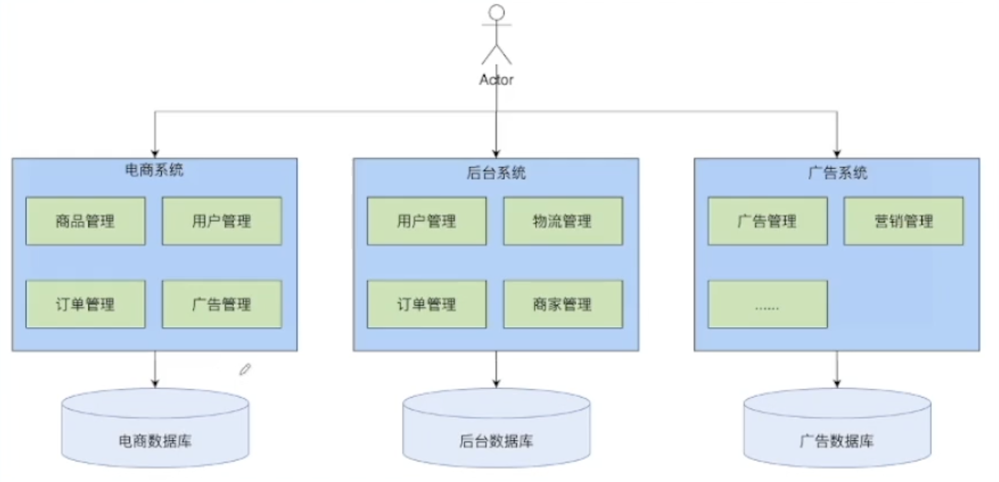
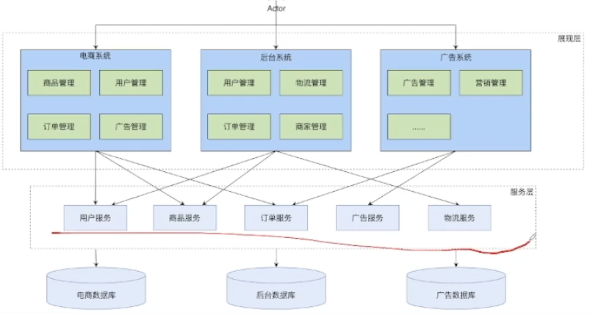
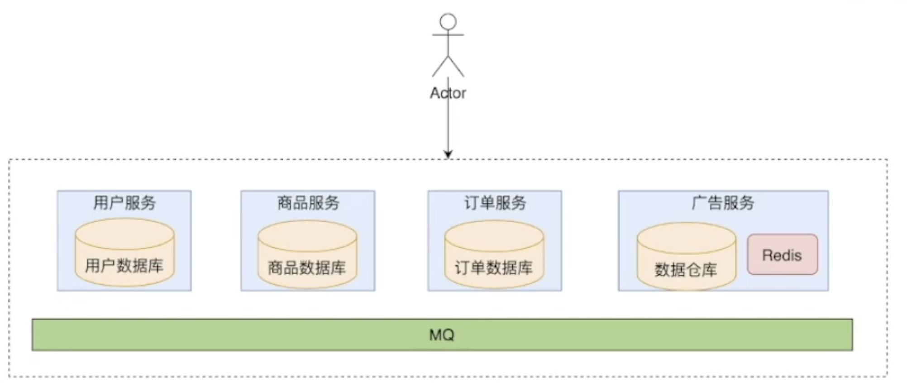
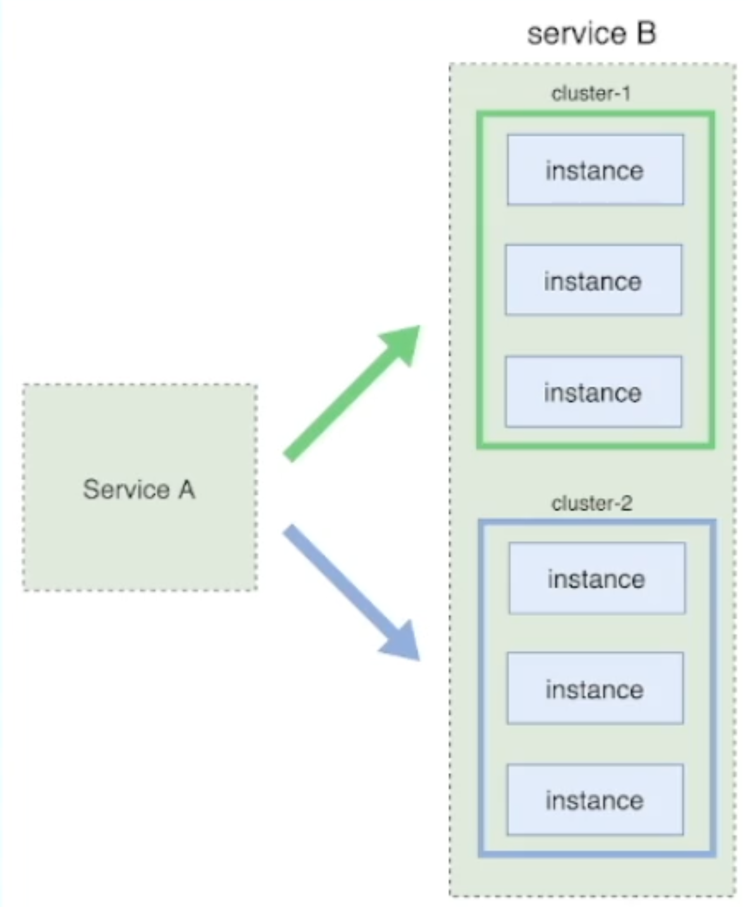
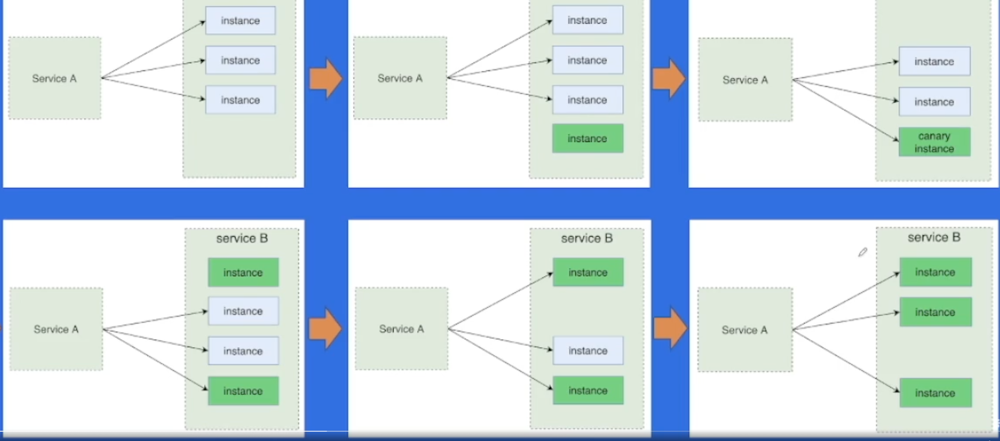

#  

## 系统架构演变历史

### 单体架构

**优势**

+ 性能最高
+ 冗余小

**劣势**

+ debug困难
+ 模块相互影响
+ 模块分工、开发流程

### 垂直应用架构

> 按照业务线垂直划分

**优势**

+ 业务独立开发维护

**劣势**

+ 不同业务存在荣誉
+ 每个业务还是单体

> 只是按照不同的业务线将模块分开了，每一个分开的模块也还是单体架构。所以在每一个业务线中，一个业务单体还是有单体架构的问题

### 分布式架构

> 抽取出业务无关的公共模块

**优势**

+ 业务无关的独立服务

**劣势**

+ 服务模块BUG可导致全站瘫痪
+ 调用关系复杂
+ 不可服务冗余

### SOA架构

> 面向服务
>
> 相对于分布式架构来说，SOA架构使用注册中心来做服务注册与发现，和服务端进行了解偶。

**优点**

+ 服务注册

**缺点**

+ 整个系统设计是中心化的
+ 需要从上到下设计
+ 重构困难

### 微服务架构

> 彻底的服务化

微服务 (Microservices) 就是一些协同工作小而自治的服务。

> 2014年，[Martin Fowler](https://link.zhihu.com/?target=https%3A//zh.wikipedia.org/wiki/Martin_Fowler) 与 [James Lewis](https://link.zhihu.com/?target=https%3A//zh.wikipedia.org/w/index.php%3Ftitle%3DJames_Lewis%26action%3Dedit%26redlink%3D1) 共同提出了微服务的概念，定义了微服务是由以单一应用程序构成的小服务，自己拥有自己的行程与轻量化处理，服务依业务功能设计，以全自动的方式部署，与其他服务使用 HTTP API 通信。同时服务会使用最小的规模的集中管理 (例如 [Docker](https://link.zhihu.com/?target=https%3A//zh.wikipedia.org/wiki/Docker)) 能力，服务可以用不同的编程语言与数据库等组件实现 。「维基百科」
>
> 

## **微服务与SOA**

**面向服务的体系结构** SOA (Service-Oriented Architecture) 听起来和微服务很像，但 SOA 早期均使用了总线模式，这种总线模式是与某种技术栈强绑定的，比如：J2EE。这导致很多企业的遗留系统很难对接，切换时间太长，成本太高，新系统稳定性的收敛也需要一些时间，最终 SOA 看起来很美，但却成为了企业级奢侈品，中小公司都望而生畏。 

此外，实施SOA时会遇到很多问题，比如通信协议（例如SOAP)的选择、第三方中间件如何选择、服务粒度如何确定等，目前也存在一些关于如何划分系统的指导性原则，但其中有很多都是错误的。SOA并没有告诉你如何划分单体应用成微服务，所以在实施SOA时会遇到很多问题。

这些问题再微服务框架中得到很好的解决，你可以认为微服务架构是SOA的一种特定方法。

## **微服务架构**

合久必分，鉴于「单体应用程序」有上述的缺点，单个应用程序被划分成各种小的、互相连接的微服务，一个微服务完成一个比较单一的功能，相互之间保持独立和解耦合，这就是微服务架构。

### **微服务优点**

相对于单体服务，微服务有很多优点，这里列举几个主要的好处

### 技术异构性

不同服务内部的开发技术可以不一致，你可以用java来开发helloworld服务A，用golang来开发helloworld服务B，大家再也不用为哪种语言是世界上最好的语言而争论不休。为不同的服务选择最适合该服务的技术，系统中不同部分也可以使用不同的存储技术，比如A服务可以选择redis存储，B服务你可以选择用MySQL存储，这都是允许的，你的服务你做主。

### 隔离性

一个服务不可用不会导致另一个服务也瘫痪，因为各个服务是相互独立和自治的系统。这在单体应用程序中是做不到的，单体应用程序中某个模块瘫痪，必将导致整个系统不可用，当然，单体程序也可以在不同机器上部署同样的程序来实现备份，不过，同样存在上面说的资源浪费问题。

### 可扩展性

庞大的单体服务如果出现性能瓶颈只能对软件整体进行扩展，可能真正影响性能的只是其中一个很小的模块，我们也不得不付出升级整个应用的代价。这在微服务架构中得到了改善，你可以只对那些影响性能的服务做扩展升级，这样对症下药的效果是很好的。

### 简化部署

如果你的服务是一个超大的单体服务，有几百万行代码，即使修改了几行代码也要重新编译整个应用，这显然是非常繁琐的，而且软件变更带来的不确定性非常高，软件部署的影响也非常大。在微服务架构中，各个服务的部署是独立的，如果真出了问题也只是影响单个服务，可以快速回滚版本解决。

### 易优化

微服务架构中单个服务的代码量不会很大，这样当你需要重构或者优化这部分服务的时候，就会容易很多，毕竟，代码量越少意味着代码改动带来的影响越可控。

### **微服务缺点**

我们上面一直在强调微服务的好处，但是，微服务架构不是万能的，并不能解决所有问题，其实这也是微服务把单体应用拆分成很多小的分布式服务导致的，所谓人多手杂，服务多起来管理的不好各种问题就来了。

为了解决微服务的缺点，前辈们提出了下面这些概念。

### 服务注册与发现

微服务之间相互调用完成整体业务功能，如何在众多微服务中找到正确的目标服务地址，这就是所谓「服务发现」功能。

常用的做法是服务提供方启动的时候把自己的地址上报给「服务注册中心」，这就是「服务注册」。服务调用方「订阅」服务变更「通知」，动态的接收服务注册中心推送的服务地址列表，以后想找哪个服务直接发给他就可以。

### 服务监控

单体程序的监控运维还好说，大型微服务架构的服务运维是一大挑战。服务运维人员需要实时的掌握服务运行中的各种状态，最好有个控制面板能看到服务的内存使用率、调用次数、健康状况等信息。

这就需要我们有一套完备的服务监控体系，包括拓扑关系、监控（Metrics）、日志监控（Logging）、调用追踪（Trace）、告警通知、健康检查等，防患于未然。

### 服务容错

任何服务都不能保证100%不出问题，生产环境复杂多变，服务运行过程中不可避免的发生各种故障（宕机、过载等等），工程师能够做的是在故障发生时尽可能降低影响范围、尽快恢复正常服务。

程序员为此避免被祭天，需要引入「熔断、隔离、限流和降级、超时机制」等「服务容错」机制来保证服务持续可用性。

### 服务安全

有些服务的敏感数据存在安全问题，「服务安全」就是对敏感服务采用安全鉴权机制，对服务的访问需要进行相应的身份验证和授权，防止数据泄露的风险，安全是一个长久的话题，在微服务中也有很多工作要做。

## **服务治理**

说到「治理」一般都是有问题才需要治理，我们平常说环境治理、污染治理一个意思，微服务架构中的微服务越来越多，上面说的那些问题就更加显现，为了解决上面微服务架构缺陷「服务治理」就出现了。

微服务的那些问题都要公司技术团队自己解决的话，如果不是大型公司有成熟的技术团队，估计会很头大。幸好，有巨人的肩膀可以借给我们站上去，通过引入「微服务框架」来帮助我们完成服务治理。

**优点**

+ 开发效率
+ 业务独立设计
+ 自上而下
+ 故障隔离

**缺点**

+ 治理、运维难度
+ 观测挑战
+ 安全性
+ 分布式系统

微服务架构的核心要素：

服务治理：

+ 服务注册
+ 服务发现
+ 负载均衡
+ 流量治理
+ 。。。

可观测性

+ 日志采集
+ 日志分析
+ 监控打点
+ 监控大盘
+ 异常报警
+ 链路追踪
+ 。。

安全

+ 身份验证
+ 认证授权
+ 访问令牌
+ 审计
+ 传输加密
+ 黑产攻击
+ 。。。

## 微服务架构原理以及特征

服务（service）：一组具有相同逻辑的运行实体（也就是一个服务必须运行同一段代码。 ） 一个服务就是多个运行的实例

实例（instance）：一个服务中，每个运行实体就是一个实例

实例与进程的关系：进程与实例之间没有必然的关系，可以一个实例对应一个或多个进程，（反之不常见）

集群（cluster）：通常指服务内部的逻辑划分，包含多个实例

有状态/无状态服务：服务的实例是否存储了可持久化的数据（例如磁盘文件）

### 服务发布的难点：

服务不可用：在服务发布的时候，如果是把前一个kill了，再重新部署

服务抖动：一部分kill，然后进行替换。kill一个替换一个。但是，这样会导致服务抖动。还是有一部分请求是会失败的；

服务回滚：当部署上线的服务出现了bug，那就需要重新部署上一次的，因此就需要服务回滚；

### 服务发布

**蓝绿部署**

1. 先把绿色部分的流量导入到蓝色集群中
2. 更新绿色集群
3. 将蓝色集群的流量导入到绿色节点中
4. 然后再升级蓝色的集群

> 这样部署的好处非常明显，可以实现平滑的迭代更新。
>
> 但是也存在一定的缺点：需要两个这样的集群才可以

**灰度发布**（金丝雀发布）

1. 先发布一个新版本的服务，然后把它加入到集群当中去
2. 等这个服务运行正常了再删除掉一个老的服务
3. ♻️ 循环往复直到部署完成

> 1. 难点是需要以实例为单位进行流量的控制。必须得不停的进行流量控制
> 2. 回滚：当升级到99%的时候，发现新代码有BUG，这个时候需要很强大的回滚资源才可以。

