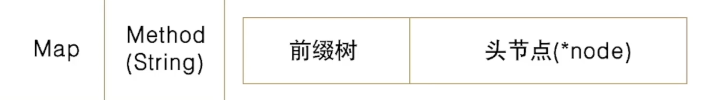
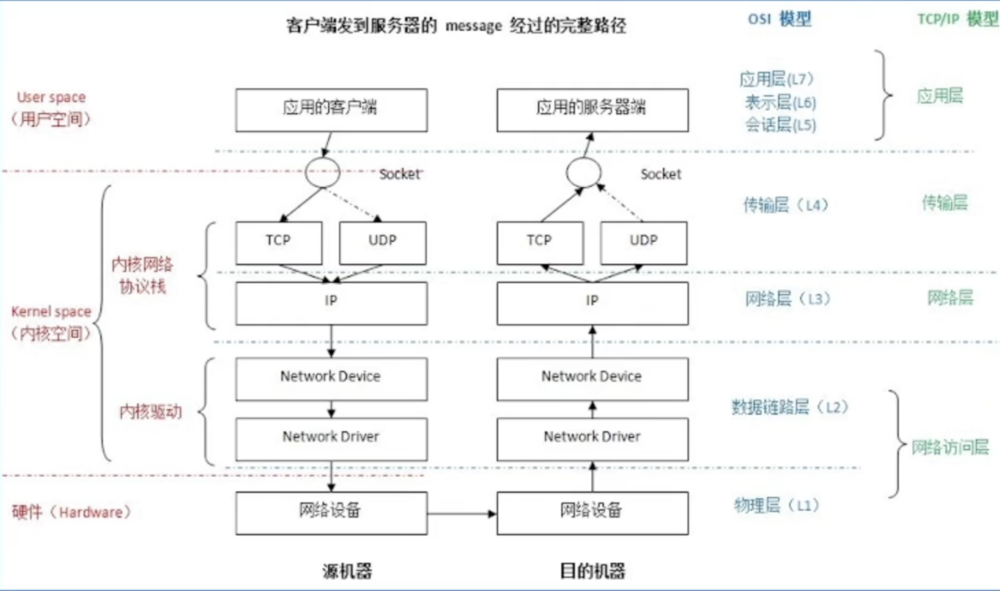
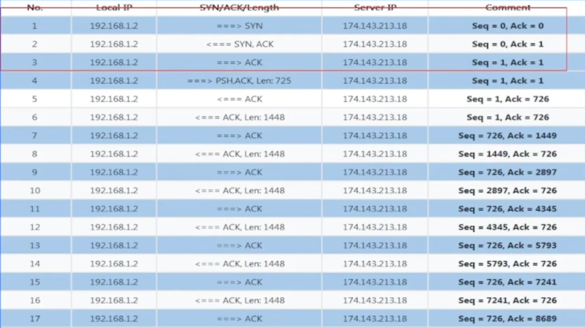
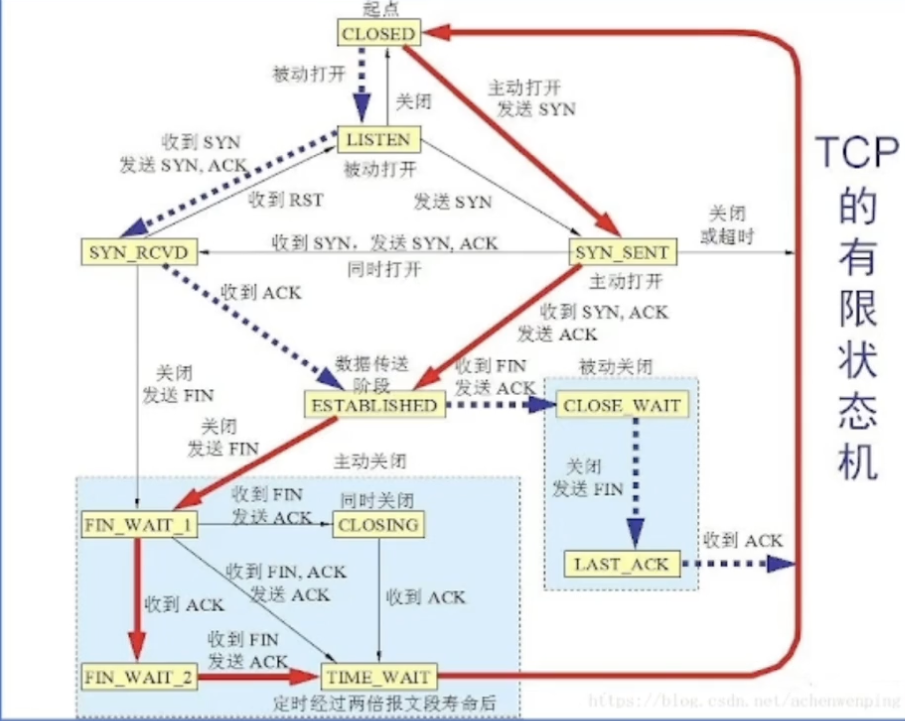

# HTTP协议

**HTTP协议定义**：超文本传输协议

常见的方法名：GET、HEAD、POST、PUT、DELETE、CONNETCT、OPTIONS、TRACE、PATCH

状态码：

1xx:信息类

2xx:成功

3xx:重定向

4xx:客户端错误

5xx:服务端错误

| OSI七层网络模型        | TCP/IP四层概念模型 | 对应网络协议                            |
| ---------------------- | ------------------ | --------------------------------------- |
| 应用层（application    | 应用层             | HTTP\TFTP\FTP\NFS\WAIS\SMTP             |
| 表示层（Presentation） | 应用层             | Telnet、Rlogin、SNMP、Gopher            |
| 会话层（Session）      | 应用层             | SMTP、DNS                               |
| 传输层（Transport）    | 传输层             | TCP、UDP                                |
| 网络层（Network）      | 网络层             | IP、ICMP、ARP、RARP、AKP、UUCP          |
| 数据链路层（DataLink） | 数据链路层         | FDDI、Ethernet、Arpanet、PDN、SLIP、PPP |
| 物理层（Physial）      | 数据链路层         | IEEE 802.1A IEEE 802.2到IEEE 802.11     |

DNS本身是基于DNS协议的

## TCP

TCP 三次握手，

**sequence number**表示的是我方9发送方）这边，这个packet的数据部分的第一位应该在整个data stream中所在的位置

**acknowledge nunmber**表示的是期望的对方（接收方）的下一次sequence number是多少。⚠️注意：SYN/FIN的传输虽然没有data，但是会让下一次传输的packet seq增加一，但是，ACK的传输不回让下一次的传输packet加一 

**TCP的传输**

**HTTP**：HTTP只是在TCP上增加了一层规矩，HTTP依然是TCP，只是这个规矩让用户更清晰，更简洁

**HTTPS**：加密传输的内容，主要是SSL/TLS握手，HTTPS中的非对称加密主要是通过第三方的CA去做的，让第三方的服务去颁发加密的公钥和证书，

**网络提速-QUIC/HTTP3.0**

使用UDP去做的，能够解决队头阻塞问题，具有弱网优势（因为可以解决弱网优势）