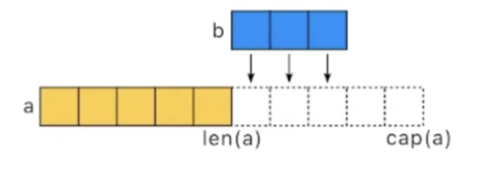
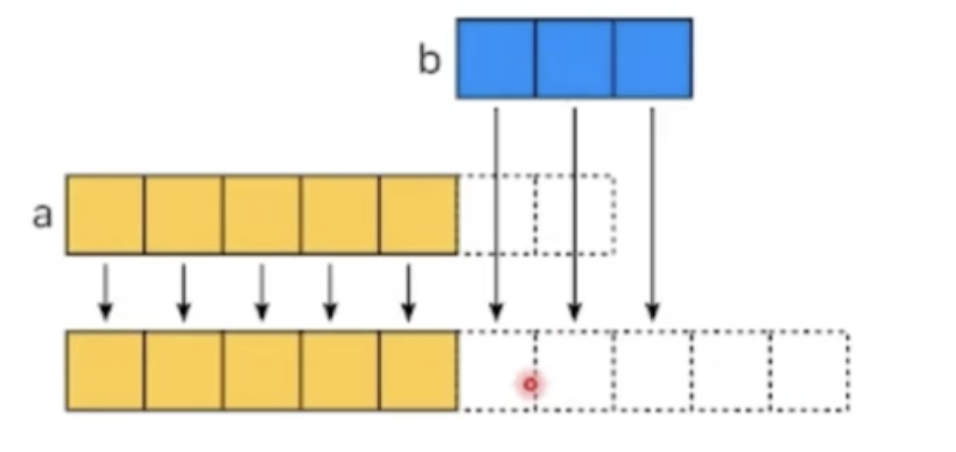
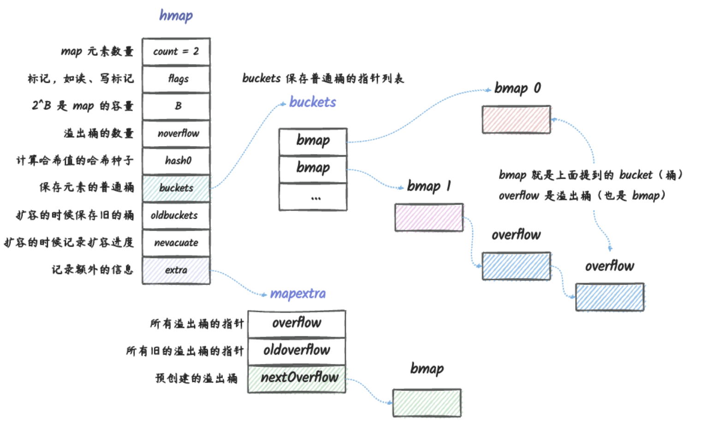
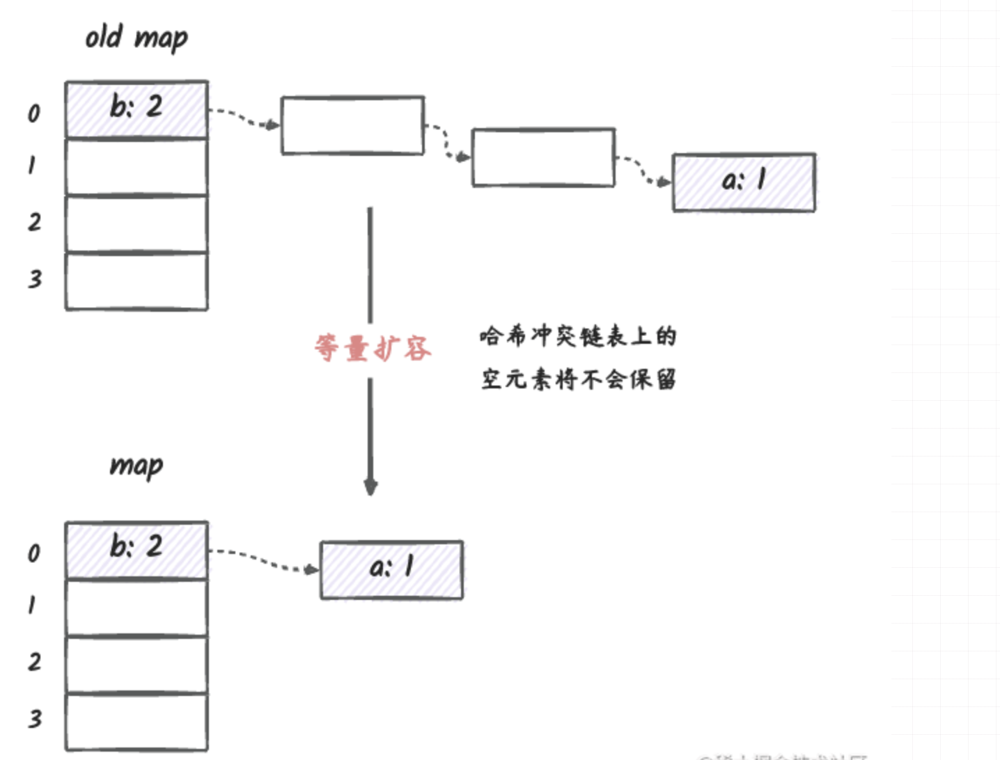

#  高质量编程以及编码规范


## 性能建议

**Slice**：尽可能在使用`make()`初始化切片时提供容量信息,这样就可以避免底层的内存分配次数， 

```go
func NoPreAlloc(size int) {
	data := make([]int, 0)
	for k := 0; k < size; k++ {
		data = append(data, k)
	}
}

func PreAlloc(size int) {
	data := make([]int, 0, size)
	for k := 0; k < size; k++ {
		data = append(data, k)
	}
}
```

在Go语言中，

+ 切片的本质是一个数组片段的描述

	+ 包括数组指针

	+ 片段的长度

	+ 片段的容量（不改变内存分配情况下的最大长度）

+ 切片操作并不复制切片指向的元素
+ 创建一个新的切片会复用原来的切片的底层数组

```go
type slice struct{
	array unsafe.Pointer
	len int
	cap int
}
```

当我们在切片中添加一个或者多个元素的时候，可能会发生以下两种操作的其中一种。

+ 当原来切片容量足够的时候，直接将需要添加到切片的内容追加到原来切片的后面

	

+ 当原来切片容量不够的时候，就需要先将原来的切片扩容，扩容之后再将需要添加到切片中的内容题添加到切片后面。但是，这种操作就比较消耗时间了，因为我们需要1.底层数组扩容。2.将需要追加的内容追加到新的切片后面。（切片具体的扩容方式在上一篇笔记当中）

	

​		

**另一个陷阱：大内存未释放**

+ 在已有切片基础上创建切片，不会创建新的底层数组

	比如说原始的切片较大，有一个切片从原始的切片上截取了个别的比较短的切片，这就会导致原来的底层数组依然在内存当中得不到释放。

	因此，我们可以使用copy来代替原来的切片操作

	```go
	func GetLastBySlice(origin []int) []int {
		return origin[len(origin)-2:]
	}
	// 用这种方式的话就会节约很大一部分内存
	func GetLastByCopy(origin []int) []int {
		result := make([]int, 2, 2)
		copy(result, origin[len(origin)-2:])
		return result
	}
	```

	

同理，map如果预分配的话，其性能会好很多。

如果不断向map中添加元素的操作就会触发map的扩容。

提前分配好空间的话可以减少内存拷贝和ReHash的消耗

**建议根据实际需求提前预估好需要的空间**


**map**

具体的map的底层实现可以看这篇文章[Go map的数据结构和源码扩容分析. (一个桶最多放8个元素，如果超过了的话，那就使用链表法增加一个overflow桶)。从下图中可以看出go 中解决哈希冲突的链表法，链表上的每一个元素是一个 `bucket`。go `map` 的实现里面，**一个 `bucket` 可以存放 `8` 个键值对**。




在 go 中，`map` 在实际存储的元素数量超过 `map` 里 `bucket` 总数量的 `6.5` 倍的时候（也就是平均每个 `bucket` 中的元素个数大于 `6.5` 的时候），会进行扩容， 这个 `6.5` 是实现 `map` 的那个开发者经过实验计算出来的比较合适的数，这个 `6.5` 被称为负载因子。


说到map扩容，那就了解一下go语言中map的底层扩容机制

在Go中，当map遇到冲突的时候，使用的是**拉链法**，（也就是用一个链表来保存hashkey相同的值）

> 提一嘴java的，在java中也是采用了这种方式，并且含有两种策略，当数组小于64的时候对数组扩容，当链表大于8的时候，那就将链表转化为红黑树以求得更快的速度。


**哈希扩容**

当元素数量变多时，会导致碰撞变多，那么bmap里面的值就会变多，查找效率会变低，所以到一定程度时就需要扩容。需要一个指标衡量，那就是负载因子。

go的负载因子规则是 `locadFactor := count / bucketCount`

即元素数量除以桶的数量，默认是6.5.（Java 的HashMap的负载因子是0.75，所以Go相对于java来说，更倾向于用空间换时间）


go中map的扩容方式有两种：**增量扩容**和**等量扩容**

**增量扩容**：在Hash表中总元素个数过多的扩容，这种扩容发生在当相同hashkey过多的时候，那么链表就会很长，当链表过长的时候元素的查找速度就会变慢，（元素过多了，链表又是依次访问，那就跟数组挨个遍历一样了）。那么，为了避免这种情况发生，一般的哈希表设计会在元素超过一定数量的时候，对哈希表扩容，这样一来，那些哈希冲突的key就可以相对均匀的分布在hash表中，从而避免了很多哈希冲突情况下导致的查找效率低下的问题。


[go map 设计与实现（参考）](https://juejin.cn/post/7177582930313609273?searchId=20230728181459065DBBCB99C4FCD01969)


> 扩容之后的容量为原来的两倍


**等量扩容**

我们知道，在哈希冲突的时候，会建立链表来保存键冲突的元素，但是我们删除那些哈希冲突的键的时候，并不会对删除元素的内存进行释放， 如果每次删除都释放的话，在我们频繁插入跟删除的时候，效率就非常低下了。 因为插入一个元素就分配内存，删除一个元素就释放内存（分配内存和释放内存都是相对耗时的操作）。 而这样的结果是，保存冲突键的链表上，有很多空的元素，这样就会导致冲突的时候，查找键的效率降低，因为要遍历很多空的键。

删除的时候不释放，那什么时候会释放呢？哈希冲突的元素很多都被删除的时候，在 go 里面，`map` 会判断就算没有超过负载因子的情况下， 如果冲突链表占用的空间过大的话，也会进行扩容。但这里说的扩容其实并不是真正意义上的扩容，只是 `map` 的实现里面，使用的函数是同一个函数。

具体实现方式是，分配跟原哈希表相同大小的空间，然后将旧哈希表的数据迁移到新的哈希表。 这样迁移之后，对于哈希冲突链表上的那些元素，只会迁移非空的元素，最终结果就是，扩容之后，哈希冲突链表上的元素更加紧凑，在查找冲突的键的时候会更加高效。


[go map 设计与实现（参考）](https://juejin.cn/post/7177582930313609273?searchId=20230728181459065DBBCB99C4FCD01969)



**strings**

在Go中，进行字符串拼接的方式有三种，第一种是直接拼接，第二种是使用strings.Builder第三种是使用bytes.Buffer的形式进行拼接。

后两种时间相对来说要快一些，最快的还是strings.Builder。在Go中字符串的大小是不变的，（类似于java）。

使用+ 每次都会重新分配内存。strings.Builder,bytes.Buffer底层都是[]yte数组，有内存扩容策略，不需要每次拼接都重新分配内存。


**空结构体**

使用空结构体节省内存。

+ 空结构体struct{}实例不占据任何的内存空间
+ 可作为各种场景下的占位符使用
	+ 节省资源
	+ 空结构体本身具有很强的语义，这里不需要任何值，仅作为占位符

```go
func emptyStructMap(){
	m := make(map[int]struct{})
}
```

**使用atomic包**

```go
type atomicCounter struct{
	i int32
}

func AtomicAddOne(c *atomicCounter){
	atomic.AddInt32(&c.i,1)
}
```

使用这个包可以实现原子操作，线程安全，比加锁的方式花费的时间更少。

+ 锁的实现是通过操作系统来实现的，属于系统调用
+ atomic操作是通过硬件实现，效率比锁高
+ s y n c.Mutex应该用来保护一段逻辑，不仅仅用于保护一个变量
+ 对于非数值变量，可以使用atomic.Value，能承载一个interfae{}

