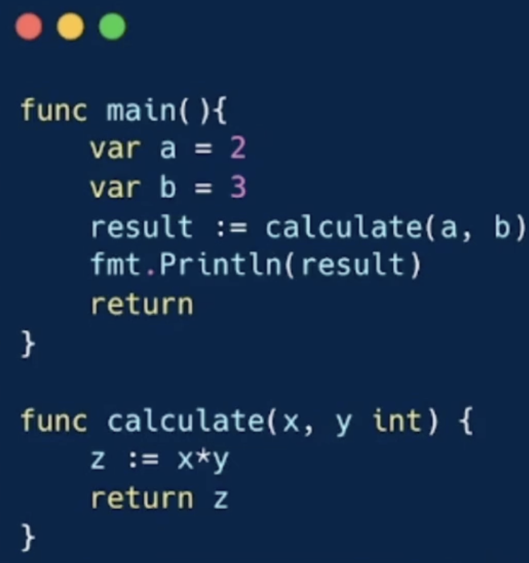
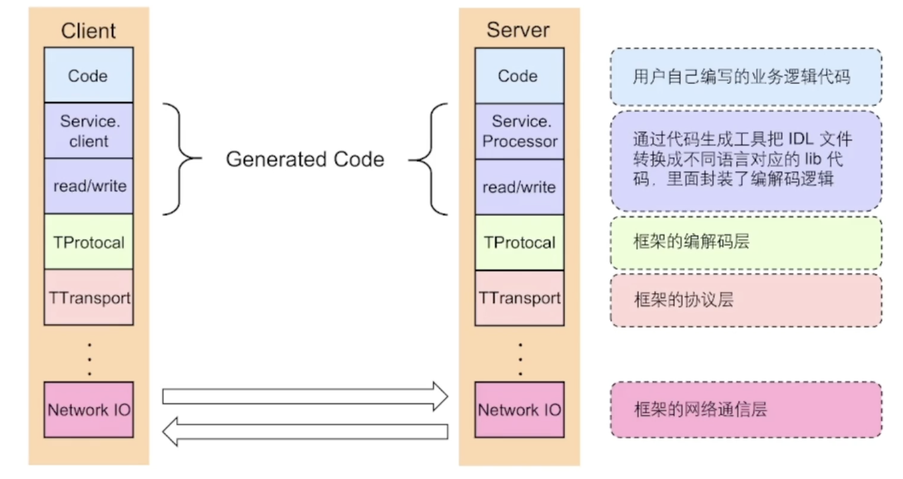
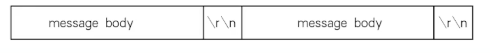
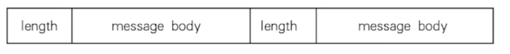

# RPC框架分层设计

**基本概念**

从一个简单的例子讲起

在`main`函数调用`calcaulate`函数的时候，会执行以下操作：

1. 将a和b的值压栈

2. 通过函数指针找到calculate函数，进入函数去除栈中的值2和3，将其赋予x和y
3. 计算下x * y ，并将结果存在z
4. 将z的值压栈，然后从calculate返回
5. 从栈中取出z返回值，并赋予result

**远程函数调用（RPC-Remote Procedure Calls）**

RPC 需要解决的问题：

1. 函数映射
2. 数据转换成字节流
3. 网络传输

**一次RPC的完整过程**

+ IDL（interface description language）文件：IDL通过一种中立的方式来描述接口，使得在不同平台上运行的对象和用不同语言编写的程序可以互相通信

+ 生成代码：通过编译器工具把IDL文件转换成语言对应的静态库
+ 编解码：从内存中表示字节序列的转换成为编码，反之称为解码，也常叫做序列化和反序列化
+ 通信协议：规范了数据在网络中的传输内容和格式。除必须的请求、响应数据外，通常还包含额外的元数据
+ 网络传输：通常基于成熟的网络库走TCP/UDP传输。

**RPC的好处**

+ 单一职责，有利于分工协作和运维开发
+ 可扩展性强，资源使用率更优
+ 鼓掌隔离，服务的整体可靠性高

**RPC带来的问题**

+ 服务宕机，对方应该如何处理
+ 在调用过程中发生网络故障，如何保证消息的可达性
+ 请求量突然增大导致服务无法及时处理，有哪些应对措施

## RPC框架

RPC框架分为3层，分别是`编解码层`,`协议层`,`网络通信层`

 **协议**

+ 特殊结束符：一个特殊字符作为每个协议单元结束的标志

	

+ 变长协议：以定长加不定长的部分组成，其中定长的部分需要描述不定长的内容的长度

	