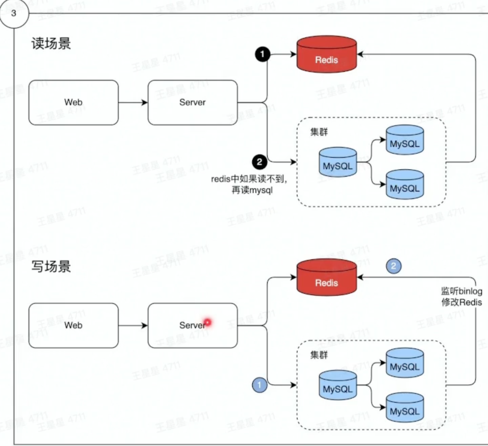
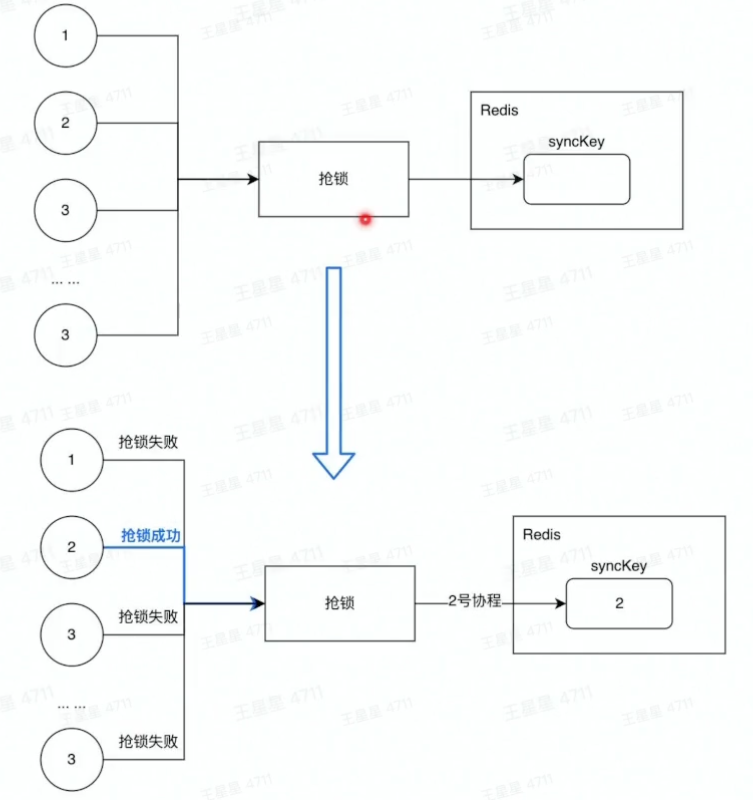
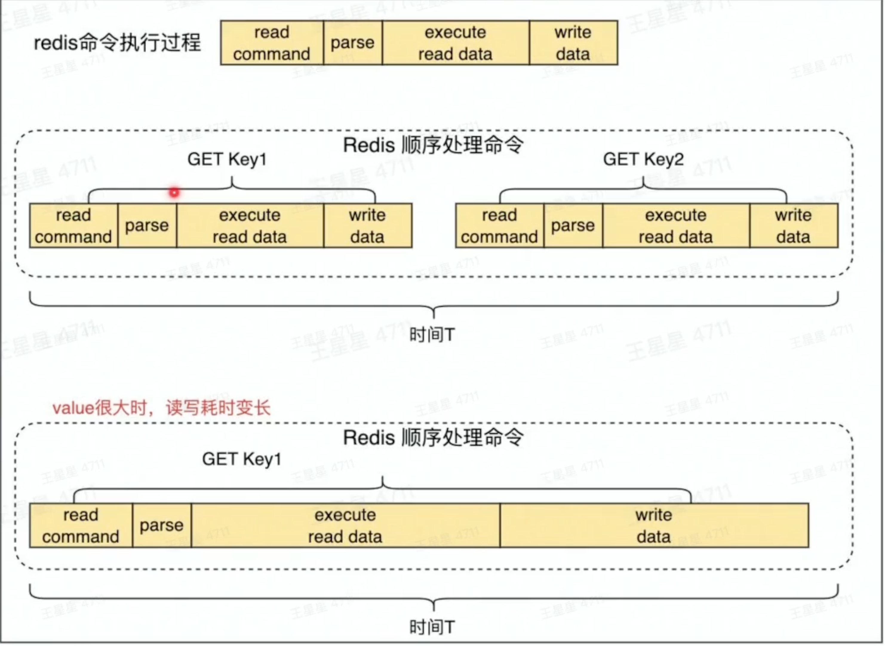
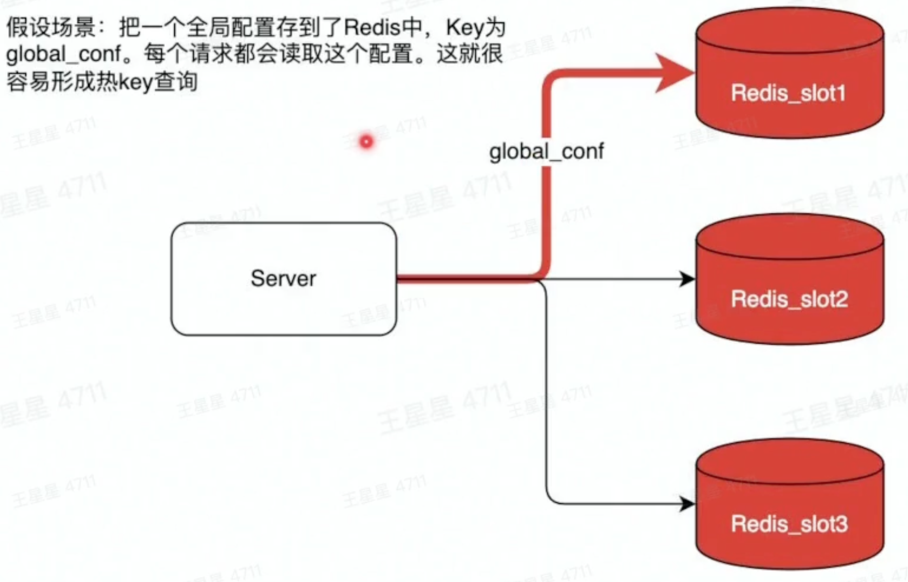
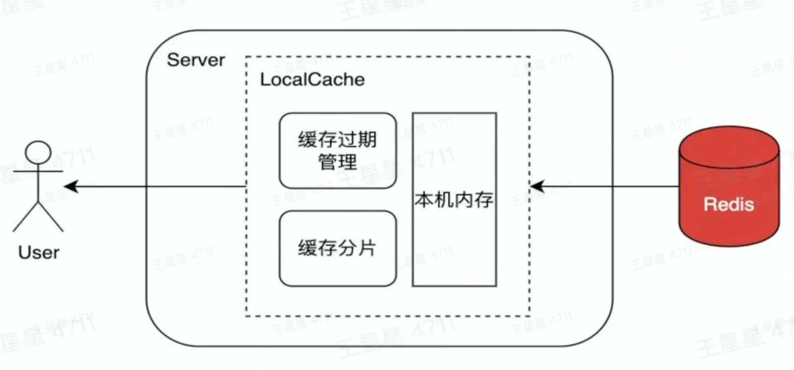
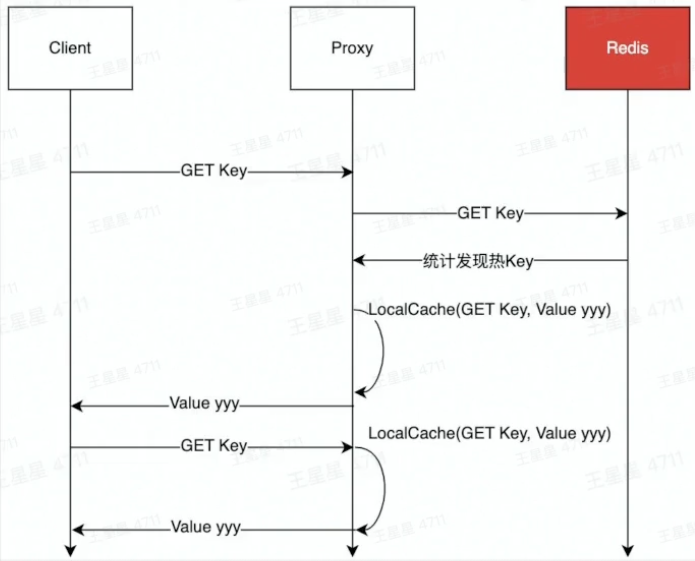

# Redis

## 为什么需要Redis

+ 数据分冷热

	+ 热数据：经常被访问到的数据（这一部分数据如果放在redis中，就可以很快的相应，并且减少数据压力）

		+ 将热数据存储到内存中

		

## Redis的基本工作原理


+ 数据从内存中读写
+ 数据保存到硬盘上防止重启数据丢失
	+ 增量数据保存到AOF文件
	+ 全量数据RDB文件
+ 单线程处理所有操作指令

**Redis AOF 和 RDB**

Redis 的服务器进程就是一个事件循环，最重要的有两个事件：文件事件和时间事件。Redis 在服务器初始化后，会无限循环，处理产生的文件事件和时间事件。

文件事件常见的有：接受连接（accept）、读取（read）、写入（write）、关闭连接（close）等。

时间事件中常见的就是 serverCron，redis 核心流程中通常也只有这个时间事件。serverCron 默认配置下每100ms会被触发一次，在该时间事件中，会执行很多操作：清理过期键、AOF 后台重写、RDB 的 save point 的检查、将 aof_buf 内容写到磁盘上（flushAppendOnlyFile 函数）等等。

+ redis的持久化机制：RDB、AOF、混合持久化（redis4.0引入）

**RDB的实现原理、优缺点**

描述：类似于快照。在某个时间点，将 Redis 在内存中的数据库状态（数据库的键值对等信息）保存到磁盘里面。RDB 持久化功能生成的 RDB 文件是经过压缩的二进制文件。

命令：有两个 Redis 命令可以用于生成 RDB 文件，一个是 SAVE，另一个是 BGSAVE。

开启：使用 save point 配置，满足 save point 条件后会触发 BGSAVE 来存储一次快照，这边的 save point 检查就是在上文提到的 serverCron 中进行。

+ SAVE：生成 RDB 快照文件，但是会阻塞主进程，服务器将无法处理客户端发来的命令请求，所以通常不会直接使用该命令。
+ BGSAVE：fork 子进程来生成 RDB 快照文件，阻塞只会发生在 fork 子进程的时候，之后主进程可以正常处理请求。fork：在 Linux 系统中，调用 fork() 时，会创建出一个新进程，称为子进程，子进程会拷贝父进程的 page table。如果进程占用的内存越大，进程的 page table 也会越大，那么 fork 也会占用更多的时间。如果 Redis 占用的内存很大，那么在 fork 子进程时，则会出现明显的停顿现象。

**RDB的优点**

+ RDB 文件是是经过压缩的二进制文件，占用空间很小，它保存了 Redis 某个时间点的数据集，很适合用于做备份。
+ RDB 非常适用于灾难恢复（disaster recovery）：它只有一个文件，并且内容都非常紧凑，可以（在加密后）将它传送到别的数据中心。
+ RDB 可以最大化 redis 的性能。父进程在保存 RDB 文件时唯一要做的就是 fork 出一个子进程，然后这个子进程就会处理接下来的所有保存工作，父进程无须执行任何磁盘 I/O 操作。
+ RDB 在恢复大数据集时的速度比 AOF 的恢复速度要快。

**RDB的缺点**

+ RDB 在服务器故障时容易造成数据的丢失。RDB 允许我们通过修改 save point 配置来控制持久化的频率。但是，因为 RDB 文件需要保存整个数据集的状态， 所以它是一个比较重的操作，如果频率太频繁，可能会对 Redis 性能产生影响。所以通常可能设置至少5分钟才保存一次快照，这时如果 Redis 出现宕机等情况，则意味着最多可能丢失5分钟数据。
+ RDB 保存时使用 fork 子进程进行数据的持久化，如果数据比较大的话，fork 可能会非常耗时，造成 Redis 停止处理服务N毫秒。如果数据集很大且 CPU 比较繁忙的时候，停止服务的时间甚至会到一秒。
+ Linux fork 子进程采用的是 copy-on-write 的方式。在 Redis 执行 RDB 持久化期间，如果 client 写入数据很频繁，那么将增加 Redis 占用的内存，最坏情况下，内存的占用将达到原先的2倍。刚 fork 时，主进程和子进程共享内存，但是随着主进程需要处理写操作，主进程需要将修改的页面拷贝一份出来，然后进行修改。极端情况下，如果所有的页面都被修改，则此时的内存占用是原先的2倍。

**AOF的实现原理、优缺点**

描述：保存 Redis 服务器所执行的所有写操作命令来记录数据库状态，并在服务器启动时，通过重新执行这些命令来还原数据集。

开启：AOF 持久化默认是关闭的，可以通过配置：appendonly yes 开启。

关闭：使用配置 appendonly no 可以关闭 AOF 持久化。

AOF 持久化功能的实现可以分为三个步骤：命令追加、文件写入、文件同步。

命令追加：当 AOF 持久化功能打开时，服务器在执行完一个写命令之后，会将被执行的写命令追加到服务器状态的 aof 缓冲区（aof_buf）的末尾。

 serverCron 时间事件中会触发 flushAppendOnlyFile 函数，该函数会根据服务器配置的 appendfsync 参数值，来决定是否将 aof_buf 缓冲区的内容写入和保存到 AOF 文件。

**appendfsync 参数有三个选项：**

+ always：每处理一个命令都将 aof_buf 缓冲区中的所有内容写入并同步到AOF 文件，即每个命令都刷盘。
+ everysec：将 aof_buf 缓冲区中的所有内容写入到 AOF 文件，如果上次同步 AOF 文件的时间距离现在超过一秒钟， 那么再次对 AOF 文件进行同步， 并且这个同步操作是异步的，由一个后台线程专门负责执行，即每秒刷盘1次。
+ no：将 aof_buf 缓冲区中的所有内容写入到 AOF 文件， 但并不对 AOF 文件进行同步， 何时同步由操作系统来决定。即不执行刷盘，让操作系统自己执行刷盘。

**AOF的优点**

+ AOF 比 RDB可靠。你可以设置不同的 fsync 策略：no、everysec 和 always。默认是 everysec，在这种配置下，redis 仍然可以保持良好的性能，并且就算发生故障停机，也最多只会丢失一秒钟的数据。
+ AOF文件是一个纯追加的日志文件。即使日志因为某些原因而包含了未写入完整的命令（比如写入时磁盘已满，写入中途停机等等）， 我们也可以使用 redis-check-aof 工具也可以轻易地修复这种问题。
+ 当 AOF文件太大时，Redis 会自动在后台进行重写：重写后的新 AOF 文件包含了恢复当前数据集所需的最小命令集合。整个重写是绝对安全，因为重写是在一个新的文件上进行，同时 Redis 会继续往旧的文件追加数据。当新文件重写完毕，Redis 会把新旧文件进行切换，然后开始把数据写到新文件上。
+ AOF 文件有序地保存了对数据库执行的所有写入操作以 Redis 协议的格式保存， 因此 AOF 文件的内容非常容易被人读懂， 对文件进行分析（parse）也很轻松。如果你不小心执行了 FLUSHALL 命令把所有数据刷掉了，但只要 AOF 文件没有被重写，那么只要停止服务器， 移除 AOF 文件末尾的 FLUSHALL 命令， 并重启 Redis ， 就可以将数据集恢复到 FLUSHALL 执行之前的状态。

**AOF的缺点**

+ 对于相同的数据集，AOF 文件的大小一般会比 RDB 文件大。
+ 根据所使用的 fsync 策略，AOF 的速度可能会比 RDB 慢。通常 fsync 设置为每秒一次就能获得比较高的性能，而关闭 fsync 可以让 AOF 的速度和 RDB 一样快。
+ AOF 在过去曾经发生过这样的 bug ：因为个别命令的原因，导致 AOF 文件在重新载入时，无法将数据集恢复成保存时的原样。（举个例子，阻塞命令 BRPOPLPUSH 就曾经引起过这样的 bug ） 。虽然这种 bug 在 AOF 文件中并不常见， 但是相较而言， RDB 几乎是不可能出现这种 bug 的。


**为什么需要AOF重写**

AOF 持久化是通过保存被执行的写命令来记录数据库状态的，随着写入命令的不断增加，AOF 文件中的内容会越来越多，文件的体积也会越来越大。

**AOF重写**

描述：Redis 生成新的 AOF 文件来代替旧 AOF 文件，这个新的 AOF 文件包含重建当前数据集所需的最少命令。具体过程是遍历所有数据库的所有键，从数据库读取键现在的值，然后用一条命令去记录键值对，代替之前记录这个键值对的多条命令。

命令：有两个 Redis 命令可以用于触发 AOF 重写，一个是 BGREWRITEAOF 、另一个是 REWRITEAOF 命令；

开启：AOF 重写由两个参数共同控制，auto-aof-rewrite-percentage 和 auto-aof-rewrite-min-size，同时满足这两个条件，则触发 AOF 后台重写 BGREWRITEAOF。

```
// 当前AOF文件比上次重写后的AOF文件大小的增长比例超过100 
auto-aof-rewrite-percentage 100  
// 当前AOF文件的文件大小大于64MB 
auto-aof-rewrite-min-size 64mb
```

关闭：auto-aof-rewrite-percentage 0，指定0的百分比，以禁用自动AOF重写功能。

REWRITEAOF：进行 AOF 重写，但是会阻塞主进程，服务器将无法处理客户端发来的命令请求，通常不会直接使用该命令。

BGREWRITEAOF：fork 子进程来进行 AOF 重写，阻塞只会发生在 fork 子进程的时候，之后主进程可以正常处理请求。


**AOF后台重写存在的问题**

AOF 后台重写使用子进程进行从写，解决了主进程阻塞的问题，但是仍然存在另一个问题：子进程在进行 AOF 重写期间，服务器主进程还需要继续处理命令请求，新的命令可能会对现有的数据库状态进行修改，从而使得当前的数据库状态和重写后的 AOF 文件保存的数据库状态不一致。

**解决方式**

为了解决上述问题，Redis 引入了 AOF 重写缓冲区（aof_rewrite_buf_blocks），这个缓冲区在服务器创建子进程之后开始使用，当 Redis 服务器执行完一个写命令之后，它会同时将这个写命令追加到 AOF 缓冲区和 AOF 重写缓冲区。

这样一来可以保证：

+ 现有 AOF 文件的处理工作会如常进行。这样即使在重写的中途发生停机，现有的 AOF 文件也还是安全的。
+ 从创建子进程开始，也就是 AOF 重写开始，服务器执行的所有写命令会被记录到 AOF 重写缓冲区里面。

这样，当子进程完成 AOF 重写工作后，父进程会在 serverCron 中检测到子进程已经重写结束，则会执行以下工作：

+ 将 AOF 重写缓冲区中的所有内容写入到新 AOF 文件中，这时新 AOF 文件所保存的数据库状态将和服务器当前的数据库状态一致。
+ 对新的 AOF 文件进行改名，原子的覆盖现有的 AOF 文件，完成新旧两个 AOF 文件的替换。


## Redis使用案例

**连续签到**

用户每日有一次签到的机会，如果断签，连续签到计数将归零

连续签到的定义：每天必须在23:59:59前签到

`key:uuuid value 天数 expireAt:后天的0点`

**消息通知**

用list作为消息队列

使用场景：消息通知，例如当文章更新时，将更新后的文章推送到ES，用户就能搜索到最新的文章数据

**计数**

一个用户有多项技术需求，可通过Hash结构存储

如掘金中每一个用户的文章被点赞数，文章被阅读数

**排行榜**

积分变化时，排名要实时更新

+ 结合dict后，可实现通过key操作跳表的功能

**限流**

要求一秒内放行的请求为N，超过N则禁止访问

**分布式锁**

并发场景，要求一次只能有一个协程执行，执行完成后，其他等待中的协程才能执行

可以使用redis的setnx实现，利用了两个特性

+ redis是单线程执行命令
+ setnx只有未设置过才能执行成功



  ## redis使用注意事项

1. 大key，热key

	大key的定义：

	| 数据类型                             | 大key标准                                        |
	| ------------------------------------ | ------------------------------------------------ |
	| String                               | value的字节数大雨10KB即为大key                   |
	| Hash/Set/Zset/list等复杂数据结构类型 | 元素个数大于5000个或value字节数大于10MB即为大key |

大key的危害

+ 读取成本高
+ 容易导致慢查询（过期、删除）
+ 主从复制异常，服务阻塞，无法正常响应请求

业务使用大key的表现

+ 请求Redis超时报错



**消除大key的方法**

1. 拆分：将大key拆分为小key，例如一个String拆分成多个String
2. 压缩：将value压缩后写入redis，读取时解压再使用，压缩算法可以是gzip、snappy、lz4等。通常情况下，一个压缩算法压缩率高、则解压耗时就长。需要对实际数据进行测试后，选择一个合适的算法。如果存储的是JSON字符串，可以考虑使用MessagePack进行序列化。 
3. 集合类结构：hash、list、set、zset
	1. 拆分：可以用hash取余、位掩码的方式决定放在那个key中
	2. 区分冷热：如榜单列表场景使用zset、只缓存前10页的数据，后续数据走db

**热key**

用户访问一个key的QPS特别高，导致Server实例出现CPU负载突增或者不均的情况

热key没有明确的标准，QPS超过500就有可能被识别为热key



**解决热key的方案**

1. 设置LocalCache：在访问前，在业务服务侧设置LocalCache，降低访问Redis的QPS。LocalCache中缓存过期或者未命中，则从Redis中将数据更新到LocalCache。Java的Guava、Golang的BigCache就是这类LocalCache

	

2. 拆分：将key，value这一个热key复制写入多份，例如key1:value,key2:value 访问的时候访问多个key，但value是同一个，以此将QPS分散到不同实例上，降低负载。代价是，更新时需要更新多个key，存在数据短暂不一致的风险。

	

3. 使用Redis代理的热key承载能力

	字节跳动的redis访问代理就具备热key承载能力，本质上是结合了“热key发现”，“LocalCache”两个功能

	

	


2. 慢查询场景

	容易导致redis慢查询的操作

	+ 批量操作一次性传入过多的key/value 如mset/hmset/sadd等（建议单批次不要超过100，超过100之后性能下降明显）
	+ zset大部分命令都是O(log(n))，当大小超过5k以上时，简单的zadd/zrem也可能导致慢查询
	+ 操作的单个value过大，超过10KB，也即，避免使用大key
	+ 对大key的delete/expire操作也可能导致慢查询，redis4.0之前不支持异步删除unlink，大key删除会阻塞redis

3. **缓存穿透，缓存雪崩** （必考）

	**缓存穿透**：热点数据查询绕过缓存，直接查询数据库

	**缓存雪崩**：大量缓存同时过期

	缓存穿透的危害

	+ 查询一个一定不存在的数据
		+ 通常不会缓存不存在的数据，这类查询请求都会直接打到db，如果有系统bug或者人为攻击，那么容易导致db响应慢甚至宕机
	+ 缓存过期时：
		+ 在搞并发场景下，一个热key如果过期，会有大量请求同时击穿至db，容易影响db性能和稳定。同一时间有大量key集中过期时，也会导致大量请求落在db上，导致查询变慢，甚至出现db无法响应新的查询

	**如何减少缓存穿透**

	1. 缓存空值：如一个不存在的userid。这个id在缓存和数据库中都不存在，则可以缓存一个空值，下次再查缓存直接返空值
	2. 布隆过滤器：通过bloom filter算法（告诉你key是否存在）来存储合法key，得益于该算法超高的压缩率，只需占用极小的空间就能存储大量的key值

	**如何避免缓存雪崩**

	1. 缓存空值：将缓存失效的时间分散开，比如在原有失效时间基础上增加一个随机值，例如不同key过期时间可以设置为10分1秒过期，10分23秒过期。单位秒部分就是随机时间，这样过期时间就分散了，对于热点数据，过期时间尽量设置得长一些，冷门的数据可以相对设置过期时间短一些。
	2. 使用缓存集群，避免单机宕机造成的缓存雪崩

	