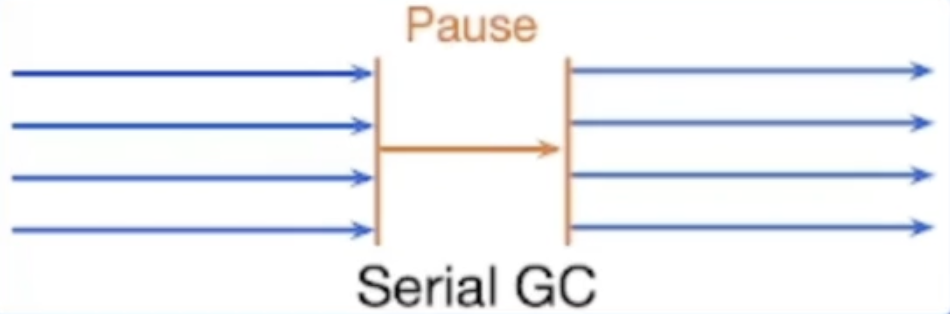
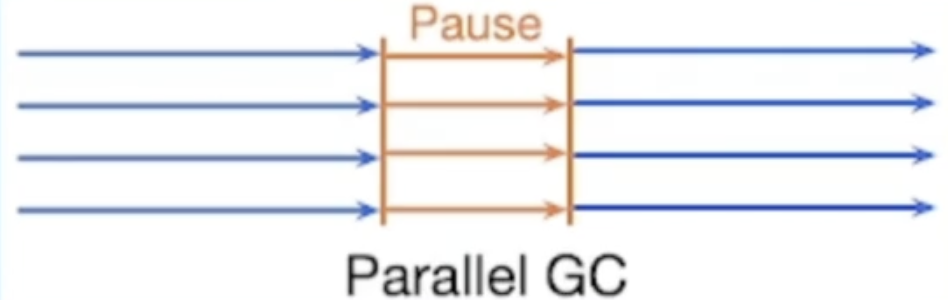
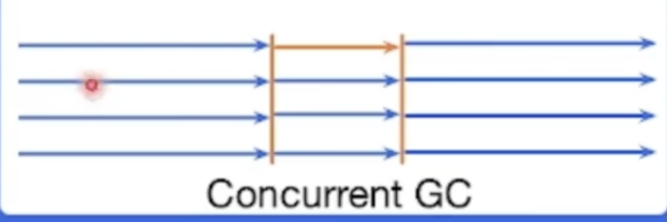
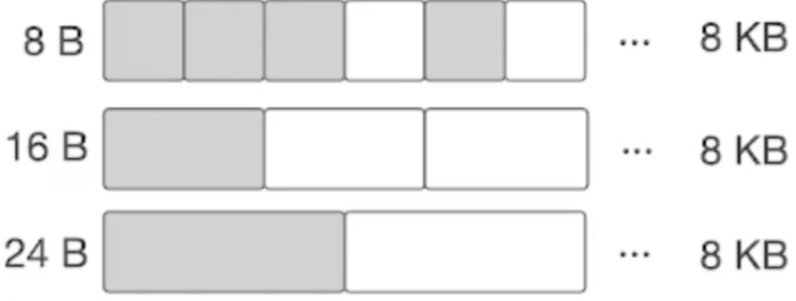
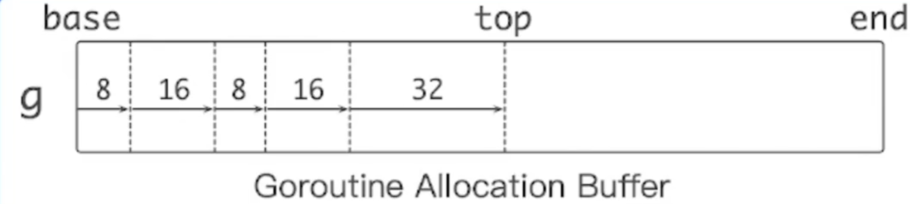

# 性能优化和自动内存管理

## 自动内存管理

+ 动态内存
	+ 程序在运行时根据需求动态分配的内存：malloc()
+ 自动内存管理（垃圾回收）：由程序语言的运行时系统管理动态内存
	+ 避免手动内存管理，专注于实现业务逻辑
	+ 保证内存使用的正确性和安全性：double-ffree problem,use-after-free problem
+ 三个任务
	+ 为新对象分配空间
	+ 找到存活的对象
	+ 回收死亡对象的内存空间

**相关概念**

+ Mutator: 业务线程，分配新对象，修改对象指向关系

+ Collector：GC线程，找到存活对象，回收死亡对象的内存空间

+ Serial GC：只有一个collector

	

	这种GC在需要GC的时候会暂停，然后使用一个GC线程（collector）去进行GC，GC完成之后再恢复。

+ Parallel GC：支持多个collectors同时回收的GC算法

	

	这种GC也会暂停，和Serial GC不同的是Parallel GC在暂停后会使用4个collector线程去进行GC。这样的话parallel的效率就会比Serial高

+ Concurrent GC： mutator(s)和collector(s)可以同时执行

	

	这种GC算法是指mutator和collector可以**同时执行**的算法。这种GC算法不会暂停，在需要做GC的时候就开一个collector去做GC。

	​	collectors必须感知对象指向关系的改变 （因为在进行垃圾回收，标记的时候用户的线程也在执行，这就可能导致新的指向对象产生）

	**评价GC算法**

	+ 安全性：不能回收存活的对象**基本要求**
	+ 吞吐率：1 - GC时间/程序执行总时间 **花在GC上的时间**
	+ 暂停时间：stop the world(STW) **业务是否感知**
	+ 内存开销：GC元数据开销

	### **两种常见的GC技术**

	**追踪垃圾回收**

	+ 对象被回收的条件：指针指向关系不可达的对象
	+ 标记根对象
		+ 静态变量、全局变量、常量、线程栈等（标记为存活对象）
	+ 标记：找到可达对象
		+ 求指针指向关系的传递闭包：从根对象出发，找到所有可达对象
	+ 清理：所有不可达对象（3个方法）思想：**根据对象的生命周期，使用不同的标记和清理策略**
		+ 将存活对象复制到另外的内存空间 Copying GC
		+ 将死亡对象的内存标记为“可分配” Mark-sweep GC
		+ 移动并整理存活对象 Mark-compact GC （把存活的对象拷贝到当前空间的最开始的部分）

	**根据对象的生命周期，使用不同的标记和清理策略**

	1. 分代GC

		+ 分代假说（Generational hypotheris）:大多数的对象很快就死掉了；

		+ 每个对象都有年龄：这个年龄就是经历过GC的次数

		+ 根据年龄将内存划分为两个区域，一个是年轻代区域(young Generation)，一个是老年代区域(old Generation)

			+ 年轻代和老年代的对象其生命周期是不一样的，因此把它们划分开，然后执行不同的GC策略，以降低整体的内存管理的开销。

		+ 年轻代：

			+ 常规的对象分配

			+ 由于存活对象很少，可以采用copying collection

				

			+ GC吞吐率高

		+ 老年代

			+ 对象趋于一直活着，反复复制的开销大

			+ 可以采用mark-sweep collection

				

**引用计数**

+ 每个对象都有一个与之关联的引用数目
+ 对象存活的条件：当且仅当引用数大于0
+ 优点
	+ 内存管理的操作被平摊到程序执行过程中(执行过程中，当对象引用数量为0的时候自然就将对象回收了)
	+ 内存管理不需要了解runtime的实现细节：C++智能指针(smart pointer)
+ 缺点：维护引用计数的开销较大：通过**原子操作**保证对引用计数操作的**原子性**和**可见性**
+ 无法回收环形数据结构（a -> b -> c -> a，但是这个环已经是不可达了）-weak reference
+ 内存开销：每个对象都引入额外的内存空间存储引用数目
+ 回收内存时依然可能引发暂停 （回收大结构）

 

## Go内存分配——分块

**目标**：为对象在heap上分配内存

**提前将内存分块**

+ 调用系统调用`mmap()`向OS申请一大块内存，例如4MB

+ 先将内存划分为大块，例如8km，称作mspan

+ 再将大块继续划分成**特定大小**的小块，用于对象分配

	

+ noscan mspan 分配不包含指针的对象---- GC不需要扫描

+ scan mspan 分配包含指针的对象------- GC需要扫描

**对象分配**：根据对象的大小，选择最合适的块返回

## Go内存分配——缓存

+ Go的内存分配借鉴了TCMalloc：thread caching （在内存分配里面加了多级的缓存以加快内存分配的速度）
+ 每一个p包含一个mcache用于快速分配，用于为绑定于p上的g分配对象
+ mcache管理一组mspan
+ 当mcache中的mspan分配完毕，想mcentral申请带有未分配块的mspan
+ 当mspan中没有分配的对象，mspan会被缓存在mcentral中，而不是立刻释放并归还给OS 

一开始是从g出发，找到mspan，在mspan中查找合适大小的内存进行返回，如果在mspan中找不到可以分配内存的块，那就再去mcentral中寻找一个mspan（带有空余对象），再把这个mspan填入mcache中去，然后再在这个mspan中把空余的内存返回回去。

## Go 内存管理优化

+ 对象分配是非常高频的操作：每秒分配GB级别的内存
+ 小对象占比较高（很多时候都是分配的80b左右的小对象）
+ Go内存分配比较耗时
	+ 分配路径长g -> m -> p -> cache -> span -> memory block -> return pointer
	+ proof 对象分配的函数是最频繁调用的函数之一

## 字节的优化方案 Balanced GC

+ 每个g都绑定一大块内存(1KB),称作goroutine allocation buffer（GAB）

+ GAB用于noscan类型的小对象分配< 128B

+ 使用三个指针维护GAB: base end top

+ Bump pointer（指针碰撞）风格对象分配

	+ 无需和其他分配请求互斥
	+ 分配动作简单高效

	

GAB对于Go内存管理来说是一个大对象

本质：将多个小对象的分配合并成一次大对象的分配

问题：GAB的对象分配方式会导致内存被延迟释放

  

这个内存分配的思想就是将若干个小对象的内存分配合并为一个大对象的内存分配，先分配好，因此当这一块对象内还存在一个小对象的时候，这一整块大内存的对象都会被标记为存活，进而延缓GC。（内存被延迟释放）

方案：针对这一个问题，可以采取移动的方式对对象进行管理——移动GAB中存活的对象

+ 当GAB总大小超过一定阈值的时候，将GAB中存活的对象复制到另外分配的GAB中。
+ 原先的GAB可以释放，避免内存泄露
+ 本质：用copying GC的算法管理小对象 （根据对象的生命周期，使用不同标记和清理策略）

