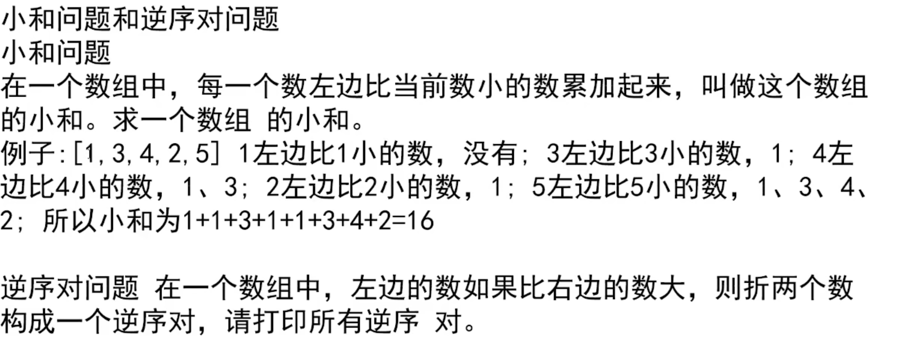
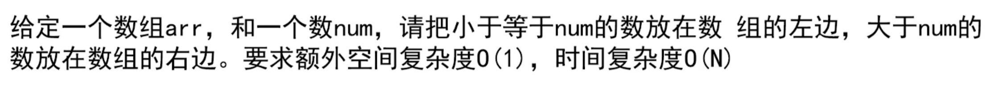

+  求数组的终点 left + （（right-left) >> 1) 
+ 递归 时间复杂度计算公式：T (N)=a*T (N/b)+O (N^d)。N母问题的规模，N/b表示子问题的规模都是N/b规模的 a 子问题被调用的次数 O (N^d)除去子问题的调用之外，剩下部分的时间复杂度
+ 
+ [[剑指 Offer 51. 数组中的逆序对](https://leetcode.cn/problems/shu-zu-zhong-de-ni-xu-dui-lcof/)](https://leetcode.cn/problems/shu-zu-zhong-de-ni-xu-dui-lcof/)

```go
package main

import (
	"fmt"
)

var sumArray []int

func merge1(leftSort, rightSort []int) []int {
	var res []int
	lp, rp := 0, 0
	for lp < len(leftSort) && rp < len(rightSort) {
		if leftSort[lp] < rightSort[rp] {
			res = append(res, leftSort[lp])
			sumArray = append(sumArray, leftSort[lp]*len(rightSort[rp:]))
			lp++
		} else {
			res = append(res, rightSort[rp])
			rp++
		}
	}
	if lp < len(leftSort) {
		res = append(res, leftSort[lp:]...)
	}
	if rp < len(rightSort) {
		res = append(res, rightSort[rp:]...)
	}
	return res
}

func mergeSort1(nums []int, left, right int) []int {
	mid := left + ((right - left) >> 1)
	if left == right {
		return []int{nums[left]}
	}
	leftSort := mergeSort1(nums, left, mid)
	rightSort := mergeSort1(nums, mid+1, right)
	return merge1(leftSort, rightSort)
}
func sum(array []int) (res int) {
	for _, v := range array {
		res += v
	}
	return
}
func main() {
	params := []int{1, 3, 4, 2, 5}
	//fmt.Printf("%+v", mergeSort1(params, 0, len(params)-1))
	mergeSort1(params, 0, len(params)-1)
	fmt.Printf("%d", sum(sumArray))
}

```




#### [2161. 根据给定数字划分数组](https://leetcode.cn/problems/partition-array-according-to-given-pivot/)

```go
func pivotArray(nums []int, pivot int) []int {
    left := -1
    right := len(nums)
    i := 0
    for i < right{
        item := nums[i]
        if item < pivot{
            left++
            nums[left],nums[i] = nums[i],nums[left]
            i++
            continue
        }
        if item == pivot{
            i++
            continue
        }
        if item > pivot{
            right--
            nums[i],nums[right] = nums[right],nums[i]
            continue
        }
    }
    return nums
}
```

