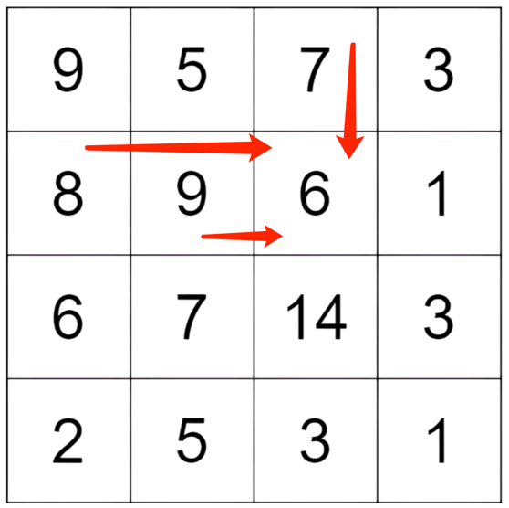

# [100281. 矩阵中的最大得分](https://leetcode.cn/problems/maximum-difference-score-in-a-grid/description/)
## 思路


先举例考虑只走一步的情况，看图中的`6`这个点，如果这个是终点的话，那么，能够通过一次移动走到这个点的路径就有三条，分别是从上面的7到6，左边的8到6和9到6。
此时，我们可以分别计算这三条路径的得分，然后保留到6的最大得分即可。

此时，我们再往前推，如果是到7，8，9呢？ 也就是以上面的7，8，9为终点的路径？ 那么同样的道理，也可以计算出分别到7，8，9的得分。
那么，我们不妨枚举数组中每一个节点为终点所能得到的最大得分，此时我们从上到下进行枚举（这样就可以概括到走n步的情况）。
再使用一个dp数组来存储对应位置为最终节点时，能够获取到的最大值。因此，dp[i][j]表示的是以i,j为终点的节点，得分的最大值。 因此，我们遍历每一个节点，对应的最大得分。
然后求出得分的最大值即可。
## 代码
### golang
```golang
func maxScore(grid [][]int) int {
    dp := make([][]int,len(grid))
    
    for i,_ := range dp{
        dp[i] = make([]int,len(grid[0]))
    }
    res := math.MinInt
    for i:=0;i<len(grid);i++{
        for j:=0;j<len(grid[0]);j++{
            // 第一行
            if i == 0{
//                 第一个空不算
                if j == 0{
                    continue
                }
                
                // 第一行
                temp := res
                for k:=0;k<j;k++{
                    temp = max(temp, grid[i][j] - grid[i][k])
                }
                dp[i][j] = temp
                continue
            }
            // 第一列
            if j == 0{
                temp := res
                for k:=0;k<i;k++{
                    temp = max(temp,grid[i][j] - grid[k][j])
                }
                dp[i][j] = temp
                continue
            }
            // 正常的单元格
            temp := res
            for k:=0;k<j;k++{
                item := grid[i][j] - grid[i][k]
                temp = max(temp,max(item,item+dp[i][k]))
            }
            for k:=0;k<i;k++{
                item := grid[i][j] - grid[k][j]
                temp = max(temp,max(item,item+dp[k][j]))
            }
            dp[i][j] = temp
        }
    }
    
    for i:=0;i<len(dp);i++{
        for j:=0;j<len(dp[0]);j++{
            if i == 0 && j == 0{
                continue
            }
            res = max(dp[i][j],res)
        }
    }
    return res
    
}


func max(a,b int)int{
    if a > b{
        return a
    }
    return b
}


```