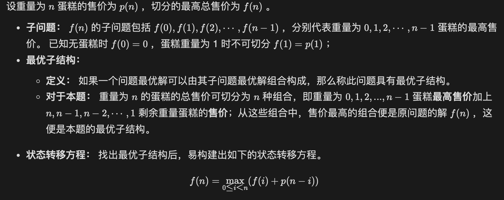

# 动态规划

## 引言

动态规划是算法与数据结构的重难点之一，其包含了「分治思想」、「空间换时间」、「最优解」等多种基石算法思想，常作为笔面试中的中等困难题出现。为帮助读者全面理解动态规划，知晓其来龙去脉，本文将从以下几个角度切入介绍：

1. 动态规划问题特点，动态规划和分治算法的联系与区别；
2. 借助例题介绍重叠子问题和最优子结构分别是什么，以及动态规划是如何解决它们的；
3. 动态规划的解题框架总结；
4. 动态规划的练习例题，从易到难排序；

## 动态规划的特点

「分治」是算法中的一种基本思想，其通过将原问题分解为子问题，不断递归地将子问题分解为更小的子问题，并通过组合子问题的解来得到原问题的解。

类似于分治算法，「动态规划」也通过组合子问题的解得到原问题的解。不同的是，适合用动态规划解决的问题具有「重叠子问题」和「最优子结构」两大特性。


### 重叠子问题

动态规划的子问题是有重叠的，即各个子问题中包含重复的更小子问题。若使用暴力法穷举，求解这些相同子问题会产生大量的重复计算，效率低下。

动态规划在第一次求解某子问题时，会将子问题的解保存；后续遇到重叠子问题时，则直接通过查表获取解，保证每个独立子问题只被计算一次，从而降低算法的时间复杂度。

### 最优子结构

如果一个问题的最优解可以由其子问题的最优解组合构成，并且这些子问题可以独立求解，那么称此问题具有最优子结构。动态规划从基础问题的解开始，不断迭代**组合、选择子问题的最优解**，最终得到原问题最优解。


**重叠子问题示例：斐波那契数列**

> 斐波那契数形成的数列为[0,1,1,2,3,5,8,12,...],数学定义如下
>
> F0 = 0
>
> F1 = 1
>
> Fn = Fn-1+Fn-2
>
> 

递归本质上是基于分治思想的从顶至底的解法。借助记忆化递归思想，可应用动态规划从底至顶求取 f(n)*f*(*n*) ，代码如下所示。

```java
// 求第 n 个斐波那契数
int fibonacci(int n) {
    if (n == 0) return 0;          // 若求 f(0) 则直接返回 0
    int[] dp = new int[n + 1];     // 初始化 dp 列表
    dp[1] = 1;                     // 初始化 f(0), f(1)
    for (int i = 2; i <= n; i++) { // 状态转移求取 f(2), f(3), ..., f(n) 
        dp[i] = dp[i - 1] + dp[i - 2];
    }
    return dp[n];                  // 返回 f(n)
}
```


**最优子结构示例：蛋糕最高售价**

> 小力开了一家蛋糕店，并针对不同重量的蛋糕设定了不同售价，分别为：
>
> | 蛋糕重量 | 0    | 1    | 2    | 3    | 4    |
> | -------- | ---- | ---- | ---- | ---- | ---- |
> | 售价     | 0    | 2    | 3    | 6    | 7    |




​											


作者：Krahets
链接：https://leetcode.cn/leetbook/read/illustration-of-algorithm/m5zfc1/
来源：力扣（LeetCode）
著作权归作者所有。商业转载请联系作者获得授权，非商业转载请注明出处。