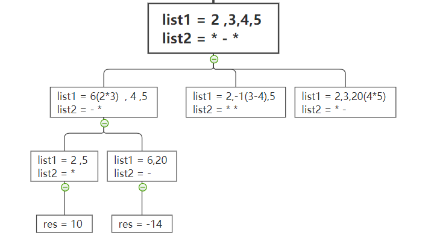

# 241. 为运算表达式设计优先级
[leetcode链接](https://leetcode.cn/problems/different-ways-to-add-parentheses/)

给你一个由数字和运算符组成的字符串 expression ，按不同优先级组合数字和运算符，计算并返回所有可能组合的结果。你可以 按任意顺序 返回答案。

生成的测试用例满足其对应输出值符合 32 位整数范围，不同结果的数量不超过 104 。

示例 1：
```
输入：expression = "2-1-1"
输出：[0,2]
解释：
((2-1)-1) = 0 
(2-(1-1)) = 2
```
示例 2：
```
输入：expression = "2*3-4*5"
输出：[-34,-14,-10,-10,10]
```
解释：

(2*(3-(4*5))) = -34 

((2*3)-(4*5)) = -14 

((2*(3-4))*5) = -10 

(2*((3-4)*5)) = -10 

(((2*3)-4)*5) = 10
 

提示：

1 <= expression.length <= 20

expression 由数字和算符 '+'、'-' 和 '*' 组成。

输入表达式中的所有整数值在范围 [0, 99] 

## 思路
在题解中大部分人都是用的分治法，在刷题的时候我想到的是使用回溯法。（事后觉得分治法更好）

暂时先贴出回溯法的解题思路
加括号的目的便是让两个数和括号中的运算符进行计算，理解了这一层意思之后在程序中便使用回溯的方式往下递归并且需要加括号的地方直接先计算其值，然后替换即可。
具体实现是
+ 处理字符串，将数字和运算符分开，数字为一个列表，运算符为一个列表（顺序不能乱）
+ 开始回溯
  回溯的树如下图所示
  

这样的回溯做出来后会出现一个问题，结果中多计算了一次(2*3)-(4\*5)
因为2*3 在第一颗树中计算过，第一个分支会回溯到4*5，所以产生了结果-14。当顶层回溯走到第四个分支时计算到了4\*5，然后其子分支又会计算出2\*3的组合，因此就会重复。
为了解决这个问题，可以在回溯方法中添加x变脸，检测分支，（具体体现在下面代码中）

## 代码
 ### java
``` java
class Solution {
    List<Integer> res = new LinkedList<>();
    public List<Integer> diffWaysToCompute(String expression) {

        StringBuilder item = new StringBuilder();
        List<Character> general = new LinkedList<>();
        List<String> number = new LinkedList<>();
        for(int i=0;i<expression.length();i++){
            char charAt = expression.charAt(i);
            if (charAt == '+' || charAt == '-'||charAt=='*'){
                general.add(charAt);
                number.add(item.toString());
                item = new StringBuilder();
                continue;
            }
            item.append(charAt);
        }
        number.add(item.toString());
        backtracking(general,number,0);
        return res;
    }


    public void backtracking(List<Character> general, List<String> number,int x){
        if(general.size() == 0){
            res.add(Integer.valueOf(number.get(0)));
            return;
        }
        for(int i=0;i<general.size();i++){
            if(i<x){
                continue;
            }
            int params1 = Integer.parseInt(number.get(i));
            int params2 = Integer.parseInt(number.get(i+1));

            int simpleRes = 0;
            char option = general.get(i);
            switch (option){
                case '+':simpleRes = params2+params1;break;
                case '-':simpleRes = params1 - params2;break;
                default: simpleRes = params1*params2;
            }
            general.remove(i);
            number.set(i+1,simpleRes+"");
            number.remove(i);

            backtracking(general,number,i-1);

            number.add(i,params1+"");
            number.set(i+1,params2+"");
            general.add(i,option);
        }
    }

}
```
