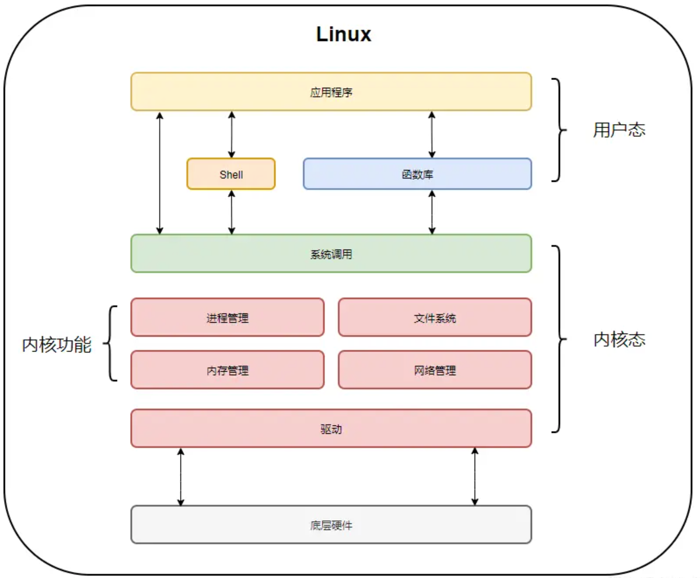

# 操作系统用户态和内核态

操作系统需要两种CPU状态，内核态（Kernel Mode）和用户态（User Mode）。

**内核态：**是一种特殊的软件程序，控制计算机的硬件资源，例如协调CPU资源，分配内存资源，并且提供稳定的环境供应用程序运行。

**用户态：**用户态就是提供应用程序运行的空间，为了使应用程序访问到内核管理的资源例如CPU，内存，I/O。内核必须提供一组通用的访问接口，这些接口就叫**系统调用。**

用户态和内核态其特权级别不同，用户态拥有最低的特权级，内核态拥有较高的特权级。**运行在用户态的程序不能直接访问操作系统内核数据结构和程序。**

那么具体的权限级别就要从CPU指令集权限开始说起了，指令集是 **C P U** 实现软件指挥硬件执行的媒介，具体来说每一条汇编语句都对应了一条 `C P U 指令`，而非常非常多的 `C P U 指令` 在一起，可以组成一个、甚至多个集合，指令的集合叫 `C P U 指令集`。有一些指令集是非常关键的，如果对其操作不规范，那就会造成整个计算机系统的崩溃，并且，对于**硬件的操作**是非常复杂的，参数众多，出问题的**几率相当大**。因此，操作系统直接不开发某些指令集的权限。因此，大家就将CPU指令集进行了分类，让能够被用户使用的指令集开放出来，不能够被使用的指令集不开放权限。因此，Intel把C PU指令集划分为了4个级别：ring0、ring1、ring2、ring3。在Linux中，仅有ring0 和 ring3两个权限。rang3是用户态，在应用程序中运行。rang0是内核态，完全在操作系统内核中运行。

ring0权限可以执行所有的CPU指令集，对硬件有所有的操作权限，访问任意的内存。

ring3权限，对硬件没有直接的控制权限，不能直接访问地址的内存，程序是通过调用系统接口（System Call Apis）来达到访问硬件和内存，在这种保护模式下，即使程序发生崩溃也是可以恢复的。电脑大部分程序都是在用户模式下的。

用户态与内核态的概念就是**C P U 指令集权限**的区别，进程中要读写 `I O`，必然会用到 **ring 0** 级别的 `C P U 指令集`，而此时 **C P U** 的指令集操作权限只有 **ring 3**，为了可以操作**ring 0** 级别的 `C P U 指令集`， **C P U** 切换指令集操作权限级别为 **ring 0**，C P U再执行相应的**ring 0** 级别的 `C P U 指令集`（**内核代码**），执行的**内核代码**会使用当前进程的内核栈。

**每个进程都有两个栈，分别是用户栈与内核栈，对应用户态与内核态的使用**

**用户态与内核态的空间 **

在内存资源上的使用，操作系统对**用户态与内核态**也做了限制，每个进程创建都会分配「虚拟空间地址」，以Linux32位操作系统为例，它的寻址空间范围是 `4G`（2的32次方），而操作系统会把虚拟控制地址划分为两部分，一部分为**内核空间**，另一部分为**用户空间**，高位的 `1G`（从虚拟地址 0xC0000000 到 0xFFFFFFFF）由内核使用，而低位的 `3G`（从虚拟地址 0x00000000 到 0xBFFFFFFF）由各个进程使用。

**用户态与内核态的切换**

内核态和用户态切换的开销较大，其开销主要是花费在一下几点：

1. 保存现场（寄存器上下文等）。也就是从用户态切换到内核态执行的时候需要将用户态当前的状态信息先保存下来，等内核态执行完了之后再恢复到原来的用户态的状态信息上继续执行。
2. 复制用户态参数，用户栈切到内核栈，进入内核态
3. 额外的检查
4. 复制内核态代码执行结果，回到用户态
5. 恢复现场（上下文，寄存器，用户栈等）

用户态要主动切换到内核态，那必须要有入口才行，实际上内核态是提供了统一的入口，下面是Linux整体架构图。

从上图我们可以看出来通过**系统调用**将Linux整个体系分为用户态和内核态，为了使应用程序访问到内核的资源，如CPU、内存、I/O，内核必须提供一组通用的访问接口，这些接口就叫**系统调用**。

## 用户态到内核态切换的情况

+ 系统调用：用户态进程主动切换到内核态的方式，用户态进程通过系统调用向操作系统申请资源完成工作，例如 fork（）就是一个创建新进程的系统调用，系统调用的机制核心使用了操作系统为用户特别开放的一个中断来实现，如Linux 的 int 80h 中断，也可以称为软中断

+ 异常：当 C P U 在执行用户态的进程时，发生了一些没有预知的异常，这时当前运行进程会切换到处理此异常的内核相关进程中，也就是切换到了内核态，如缺页异常

+ 中断：当 C P U 在执行用户态的进程时，外围设备完成用户请求的操作后，会向 C P U 发出相应的中断信号，这时 C P U 会暂停执行下一条即将要执行的指令，转到与中断信号对应的处理程序去执行，也就是切换到了内核态。如硬盘读写操作完成，系统会切换到硬盘读写的中断处理程序中执行后边的操作等。

	

# 参考文献

[从根上理解用户态与内核态](https://juejin.cn/post/6923863670132850701)

[**一文彻底理解用户态和内核态！**](https://blog.51cto.com/JavaAlliance/4803278)

